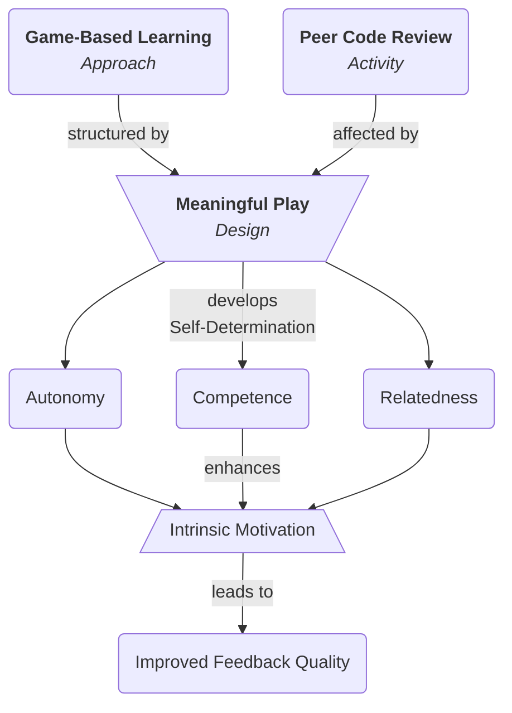

---
{"title":"Conceptual Framework","dg-publish":true,"created":"2024-02-10","modified":"2025-03-30","permalink":"/50-works/research/conceptual-framework/","dgPassFrontmatter":true,"updated":"2025-03-30"}
---

Providing effective code review feedback is a fundamental skill for Computer Science (CS) students as they prepare to enter the workforce [@sadowski2018]. From my experience as a professional software developer in the industry, I can attest to how important Peer Code Review (PCR) is for programmers. From my experience as a CS student, I know that traditional academic approaches do not always motivate learners, especially for the PCR process. Superficial feedback benefits neither the reviewer nor the reviewee and does little to improve code quality or encourage deep learning [@ramsden2003]. It is important to create an environment where feedback is constructive and empowers students as part of the development process [@hattie2007]. This is particularly beneficial for developing essential feedback skills in professional software developers. As a CS teacher, I have seen firsthand how unmotivated students can be during PCR sessions.

Low motivation during PCR in the classroom poses a significant challenge for educators aiming to maximize the effectiveness of PCR practices. As such, [[30 Permanent Notes/Self-Determination Theory\|Self-Determination Theory]] (SDT) is a meta-theory of human motivation and personality, grounded in psychological science, that provides a potential lens for understanding this phenomenon by highlighting the of three fundamental psychological needs (competence, autonomy, relatedness) for intrinsic motivation [@deci1985; @deci1994]. These terms are defined as: _competence_, where students may doubt their ability to provide valuable feedback or feel that the focus is solely on error-finding or quality-assurance testing; _autonomy_, where limited choices in how to conduct PCR (code to review, feedback format, etc.) may stifle student ownership; and _relatedness_, where a lack of community focus or a shared sense of purpose can diminish the feeling that PCR is a collaborative improvement process. Traditional PCR approaches may fail to adequately support these needs.

Game-Based Learning (GBL) offers a promising approach to address these motivational barriers hindering effective PCR. GBL prioritizes immersion, challenge, and (sometimes) social interaction [@papastergiou2009]. These elements have the potential to: _enhance competence_, where well-designed challenges and in-game rewards can build confidence as coding proficiency increases; _foster autonomy_, where GBL systems can offer choices within a structured learning experience, increasing student agency; and _promote relatedness_, where narrative and collaborative gameplay can make PCR feel more purposeful and community-oriented [@proulx2017; @uysal2016].

Students learn more effectively when they are agents in constructing their own knowledge, both individually and in collaboration with others [@vygotsky1978a]. This belief is foundational to my interest in the peer feedback process and aligns with a social-constructivist understanding of learning that emphasizes shared meaning-making through interaction. To encourage PCR, feedback systems must be intentionally designed to align with intended learning outcomes and assessment criteria [@biggs2012]. When learning outcomes related to professional behaviour and feedback literacy are clearly connected to assessment, students are more likely to see value in the process [@ladyshewsky2012].

As an avid player of both digital and analogue games, my experience in gaming also influences my interest in this topic. In the world of gaming, especially in multiplayer games, communication and teamwork are paramount for success. Similarly, in the area of PCR, effective communication and collaboration are essential for producing high-quality code. Furthermore, the problem-solving and critical thinking skills honed through gaming also translate to the world of programming and code review. The analytical mindset and attention to detail required in gaming parallel the skills needed for thorough code review [@schmitz2011]. Understanding how to motivate students in the context of PCR aligns with the principles of game design, where the goal is to create _meaningful play_ through game mechanics that link player action to future outcomes [@salen2003]. I believe my experience playing games and teaching CS provides me with a unique perspective on the dynamics of PCR and drives me to delve deeper into this topic.

This study examines students’ perceived motivation to give quality PCR feedback through the lens of SDT, focusing on how a meaningful GBL intervention might transform PCR into a more intrinsically motivating and valuable learning experience. The conceptual framework guiding this research is presented in [Figure 1], which illustrates how GBL and PCR contribute to the fulfillment of psychological needs, competence, autonomy, and relatedness, and how these, in turn, affect intrinsic motivation and improved feedback quality.

**Figure 1**

_Conceptual Framework_

