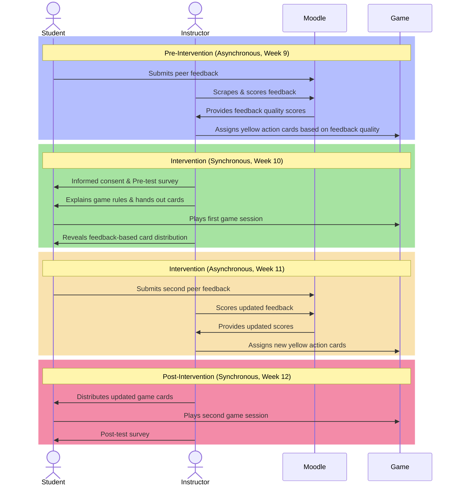

---
{"title":"Methodology","dg-publish":true,"created":"2024-03-06","modified":"2025-04-14","permalink":"/50-works/research/methodology/","dgPassFrontmatter":true,"updated":"2025-04-14"}
---

## Target Population

The target population for this study consisted of third-year students, ages generally between 18-20, enrolled at a public English-language CEGEP in Quebec, Canada. Participants were drawn from two sections of a Game Programming course offered within the Computer Science (CS) program at John Abbott College. These students were nearing the completion of their DEC (Diplôme d'études collégiales) and had completed multiple programming courses, making them well-positioned to perform more expert-level software development practices. They were selected based on their advanced programming experience and the increased importance of Peer Code Review (PCR) skills at this stage of the curriculum. Notably, these students were preparing to enter the workforce through a mandatory internship (stage) in the following semester, where collaboration, feedback, and code quality practices are emphasized by industry partners. As such, improving their ability to give and receive meaningful code feedback was both pedagogically timely and professionally relevant.

## Research Design

This study employed a mixed-methods, quasi-experimental design to investigate the following research questions:

- **RQ1:** Does a game-based learning intervention increase the quality of feedback provided during Computer Science peer code review?
- **RQ2:** Does the game-based learning intervention influence students' perceived competence, autonomy, and relatedness, as conceptualized by Self-Determination Theory?

A total of 42 students completed the pre-test. Due to absenteeism, 39 students completed the post-test and were included in the motivation analysis, while 37 students who completed both pre- and post- peer feedback activities were included in the analysis of feedback quality. Students were excluded from the feedback analysis if they had not participated in both the pre- and post-intervention activities. As a result, sample sizes vary slightly across different aspects of the analysis.

Data collection took place during Week 10 (pre-test) and Week 12 (post-test) of the Fall 2024 semester, allowing for an assessment of changes in student motivation and feedback quality over time. A pre-test/post-test design was chosen to assess within-subject changes in student motivation and feedback quality following the introduction of the GBL intervention. This design allowed students to serve as their own comparison, measuring improvements relative to their baseline performance.

## Procedure

The sequence of activities in this study is visually represented in [Figure 2].

**Figure 2**

*Intervention Sequence Diagram*

*Note.* This diagram visualizes the chronological sequence of events in the study across four key phases. Time progresses from top to bottom. The entities on the top and bottom represent the roles or systems involved: *Student*, *Instructor*, *Moodle* (an online learning management system), and *Game* (the card-based peer feedback intervention). The arrows represent direct actions (e.g., submitting feedback or handing out game cards). Each coloured section represents a week in the semester, distinguishing asynchronous phases (done outside of class time) and synchronous phases (conducted during scheduled class time).

### Pre-Intervention Phase

Prior to this study, students had been engaging in traditional peer feedback activities since Week 4 of the semester, using the PCR Rubric (Appendix A) as a reference for evaluating their peers' work. This rubric provided a structured framework that guided their feedback, ensuring consistency and clarity in their evaluations. These prior experiences with peer review helped establish a baseline understanding of feedback expectations before the intervention was introduced.

Prior to the intervention, students participated in asynchronous peer feedback through the Moodle Learning Management System's (LMS) Workshop activity [@moodle2024]. Each student provided feedback to three peers, and this feedback was extracted using a custom scraper (Appendix E) developed by the author. The extracted feedback was anonymized and analyzed using a Large Language Model (LLM) [@openai2024], which categorized comments based on a Code Review Taxonomy (Appendix B). The taxonomy classifies feedback into distinct categories based on specificity and constructiveness, such as "SA" (Specific Actionable), "G+" (General Positive), or "G0" (General Neutral).

To guide the LLM's classification, a *few-shot* approach (Appendix G) was used, in which the model was provided with a small number of labeled examples to infer how to apply the taxonomy to new comments. This strategy allows LLMs to generalize effectively without extensive training data [@anglin2024]. To verify in the LLM's classification, a subset of outputs was manually reviewed by the author. During this process, the prompting strategy and card-distribution scripts (Appendix E) were refined iteratively to improve classification consistency. While this verification process was informal and not independently validated, the reviewed samples showed a high level of agreement with the intended taxonomy categories, suggesting the LLM output was sufficiently reliable for the purposes of this exploratory study.

To quantify the quality of feedback for analysis, each taxonomy category was assigned a numerical score using a predefined conversion system (Table 1). These scores were then used to determine the number of cards received at the start of the game, introducing a performance-based starting condition for the intervention.

**Table 1**

*Numerical Conversion of Feedback Quality Scores*

| Code     | Description                       | Score |
| -------- | --------------------------------- | ----- |
| SA       | Specific Actionable               | 5     |
| S+/S-    | Specific Positive/Negative        | 4     |
| S0       | Specific Neutral                  | 3     |
| G+/G-/GA | General Positive/Negative/Advice  | 2     |
| G0/PV    | General Neutral/Placeholder Value | 1     |
| OT       | Off-topic/Irrelevant              | 0     |

Each student provided feedback to three peers, and the median of these three numerical scores was used as their individual feedback quality score in statistical analysis. The median was chosen to reduce the influence of outliers or inconsistencies in individual comments, providing a more robust measure of typical feedback quality for each student.

To ensure that the game could be reasonably completed within a class session, a simulation was developed (Appendix E) to play 1,000 rounds of the game under varying conditions. The results indicated that the average game lasted 13 turns, with the longest game reaching 24 turns. In terms of duration, the simulation estimated an average game time of 19 minutes, with the longest recorded game taking 35 minutes. These findings informed the game design parameters, such as the number of starting resources and the inclusion of time-limiting mechanics to maintain feasibility within the allotted class period.

<svg class="main-svg" xmlns="http://www.w3.org/2000/svg" xmlns:xlink="http://www.w3.org/1999/xlink" width="700" height="450" style="background: rgb(255, 255, 255);"><defs id="defs-7f8fe0"><g class="clips"><clipPath id="clip7f8fe0xyplot" class="plotclip"><rect width="540" height="270"></rect></clipPath><clipPath class="axesclip" id="clip7f8fe0x"><rect x="80" y="0" width="540" height="450"></rect></clipPath><clipPath class="axesclip" id="clip7f8fe0y"><rect x="0" y="100" width="700" height="270"></rect></clipPath><clipPath class="axesclip" id="clip7f8fe0xy"><rect x="80" y="100" width="540" height="270"></rect></clipPath></g><g class="gradients"></g><g class="patterns"></g></defs><g class="bglayer"></g><g class="draglayer cursor-crosshair"><g class="xy"><rect class="nsewdrag drag" data-subplot="xy" x="80" y="100" width="540" height="270" style="fill: transparent; stroke-width: 0; pointer-events: all;"></rect><rect class="nwdrag drag cursor-nw-resize" data-subplot="xy" x="60" y="80" width="20" height="20" style="fill: transparent; stroke-width: 0; pointer-events: all;"></rect><rect class="nedrag drag cursor-ne-resize" data-subplot="xy" x="620" y="80" width="20" height="20" style="fill: transparent; stroke-width: 0; pointer-events: all;"></rect><rect class="swdrag drag cursor-sw-resize" data-subplot="xy" x="60" y="370" width="20" height="20" style="fill: transparent; stroke-width: 0; pointer-events: all;"></rect><rect class="sedrag drag cursor-se-resize" data-subplot="xy" x="620" y="370" width="20" height="20" style="fill: transparent; stroke-width: 0; pointer-events: all;"></rect><rect class="ewdrag drag cursor-ew-resize" data-subplot="xy" x="134" y="370.5" width="432" height="20" style="fill: transparent; stroke-width: 0; pointer-events: all;"></rect><rect class="wdrag drag cursor-w-resize" data-subplot="xy" x="80" y="370.5" width="54" height="20" style="fill: transparent; stroke-width: 0; pointer-events: all;"></rect><rect class="edrag drag cursor-e-resize" data-subplot="xy" x="566" y="370.5" width="54" height="20" style="fill: transparent; stroke-width: 0; pointer-events: all;"></rect><rect class="nsdrag drag cursor-ns-resize" data-subplot="xy" x="59.5" y="127" width="20" height="216" style="fill: transparent; stroke-width: 0; pointer-events: all;"></rect><rect class="sdrag drag cursor-s-resize" data-subplot="xy" x="59.5" y="343" width="20" height="27" style="fill: transparent; stroke-width: 0; pointer-events: all;"></rect><rect class="ndrag drag cursor-n-resize" data-subplot="xy" x="59.5" y="100" width="20" height="27" style="fill: transparent; stroke-width: 0; pointer-events: all;"></rect></g></g><g class="layer-below"><g class="imagelayer"></g><g class="shapelayer"></g></g><g class="cartesianlayer"><g class="subplot xy"><g class="layer-subplot"><g class="shapelayer"></g><g class="imagelayer"></g></g><g class="gridlayer"><g class="x"></g><g class="y"><path class="ygrid crisp" transform="translate(0,325.78)" d="M80,0h540" style="stroke: rgb(238, 238, 238); stroke-opacity: 1; stroke-width: 1px;"></path><path class="ygrid crisp" transform="translate(0,281.55)" d="M80,0h540" style="stroke: rgb(238, 238, 238); stroke-opacity: 1; stroke-width: 1px;"></path><path class="ygrid crisp" transform="translate(0,237.33)" d="M80,0h540" style="stroke: rgb(238, 238, 238); stroke-opacity: 1; stroke-width: 1px;"></path><path class="ygrid crisp" transform="translate(0,193.1)" d="M80,0h540" style="stroke: rgb(238, 238, 238); stroke-opacity: 1; stroke-width: 1px;"></path><path class="ygrid crisp" transform="translate(0,148.88)" d="M80,0h540" style="stroke: rgb(238, 238, 238); stroke-opacity: 1; stroke-width: 1px;"></path><path class="ygrid crisp" transform="translate(0,104.66)" d="M80,0h540" style="stroke: rgb(238, 238, 238); stroke-opacity: 1; stroke-width: 1px;"></path></g></g><g class="zerolinelayer"><path class="yzl zl crisp" transform="translate(0,370)" d="M80,0h540" style="stroke: rgb(68, 68, 68); stroke-opacity: 1; stroke-width: 1px;"></path></g><path class="xlines-below"></path><path class="ylines-below"></path><g class="overlines-below"></g><g class="xaxislayer-below"></g><g class="yaxislayer-below"></g><g class="overaxes-below"></g><g class="plot" transform="translate(80,100)" clip-path="url(#clip7f8fe0xyplot)"><g class="barlayer mlayer"><g class="trace bars" shape-rendering="crispEdges" style="opacity: 0.8;"><g class="points"><g class="point"><path d="M0,270V268H15V270Z" style="vector-effect: non-scaling-stroke; opacity: 1; stroke-width: 0px; fill: rgb(31, 119, 180); fill-opacity: 1;"></path></g><g class="point"><path d="M15,270V263H30V270Z" style="vector-effect: non-scaling-stroke; opacity: 1; stroke-width: 0px; fill: rgb(31, 119, 180); fill-opacity: 1;"></path></g><g class="point"><path d="M30,270V248H45V270Z" style="vector-effect: non-scaling-stroke; opacity: 1; stroke-width: 0px; fill: rgb(31, 119, 180); fill-opacity: 1;"></path></g><g class="point"><path d="M45,270V195H60V270Z" style="vector-effect: non-scaling-stroke; opacity: 1; stroke-width: 0px; fill: rgb(31, 119, 180); fill-opacity: 1;"></path></g><g class="point"><path d="M60,270V177H75V270Z" style="vector-effect: non-scaling-stroke; opacity: 1; stroke-width: 0px; fill: rgb(31, 119, 180); fill-opacity: 1;"></path></g><g class="point"><path d="M75,270V84H90V270Z" style="vector-effect: non-scaling-stroke; opacity: 1; stroke-width: 0px; fill: rgb(31, 119, 180); fill-opacity: 1;"></path></g><g class="point"><path d="M90,270V27H105V270Z" style="vector-effect: non-scaling-stroke; opacity: 1; stroke-width: 0px; fill: rgb(31, 119, 180); fill-opacity: 1;"></path></g><g class="point"><path d="M105,270V14H120V270Z" style="vector-effect: non-scaling-stroke; opacity: 1; stroke-width: 0px; fill: rgb(31, 119, 180); fill-opacity: 1;"></path></g><g class="point"><path d="M120,270V62H135V270Z" style="vector-effect: non-scaling-stroke; opacity: 1; stroke-width: 0px; fill: rgb(31, 119, 180); fill-opacity: 1;"></path></g><g class="point"><path d="M135,270V38H150V270Z" style="vector-effect: non-scaling-stroke; opacity: 1; stroke-width: 0px; fill: rgb(31, 119, 180); fill-opacity: 1;"></path></g><g class="point"><path d="M150,270V122H165V270Z" style="vector-effect: non-scaling-stroke; opacity: 1; stroke-width: 0px; fill: rgb(31, 119, 180); fill-opacity: 1;"></path></g><g class="point"><path d="M165,270V111H180V270Z" style="vector-effect: non-scaling-stroke; opacity: 1; stroke-width: 0px; fill: rgb(31, 119, 180); fill-opacity: 1;"></path></g><g class="point"><path d="M180,270V131H195V270Z" style="vector-effect: non-scaling-stroke; opacity: 1; stroke-width: 0px; fill: rgb(31, 119, 180); fill-opacity: 1;"></path></g><g class="point"><path d="M195,270V142H210V270Z" style="vector-effect: non-scaling-stroke; opacity: 1; stroke-width: 0px; fill: rgb(31, 119, 180); fill-opacity: 1;"></path></g><g class="point"><path d="M210,270V179H225V270Z" style="vector-effect: non-scaling-stroke; opacity: 1; stroke-width: 0px; fill: rgb(31, 119, 180); fill-opacity: 1;"></path></g><g class="point"><path d="M225,270V210H240V270Z" style="vector-effect: non-scaling-stroke; opacity: 1; stroke-width: 0px; fill: rgb(31, 119, 180); fill-opacity: 1;"></path></g><g class="point"><path d="M240,270V230H255V270Z" style="vector-effect: non-scaling-stroke; opacity: 1; stroke-width: 0px; fill: rgb(31, 119, 180); fill-opacity: 1;"></path></g><g class="point"><path d="M255,270V232H270V270Z" style="vector-effect: non-scaling-stroke; opacity: 1; stroke-width: 0px; fill: rgb(31, 119, 180); fill-opacity: 1;"></path></g><g class="point"><path d="M270,270V248H285V270Z" style="vector-effect: non-scaling-stroke; opacity: 1; stroke-width: 0px; fill: rgb(31, 119, 180); fill-opacity: 1;"></path></g><g class="point"><path d="M285,270V255H300V270Z" style="vector-effect: non-scaling-stroke; opacity: 1; stroke-width: 0px; fill: rgb(31, 119, 180); fill-opacity: 1;"></path></g><g class="point"><path d="M300,270V255H315V270Z" style="vector-effect: non-scaling-stroke; opacity: 1; stroke-width: 0px; fill: rgb(31, 119, 180); fill-opacity: 1;"></path></g><g class="point"><path d="M315,270V263H330V270Z" style="vector-effect: non-scaling-stroke; opacity: 1; stroke-width: 0px; fill: rgb(31, 119, 180); fill-opacity: 1;"></path></g><g class="point"><path d="M330,270V266H345V270Z" style="vector-effect: non-scaling-stroke; opacity: 1; stroke-width: 0px; fill: rgb(31, 119, 180); fill-opacity: 1;"></path></g><g class="point"><path d="M345,270V263H360V270Z" style="vector-effect: non-scaling-stroke; opacity: 1; stroke-width: 0px; fill: rgb(31, 119, 180); fill-opacity: 1;"></path></g><g class="point"><path d="M360,270V270H375V270Z" style="vector-effect: non-scaling-stroke; opacity: 1; stroke-width: 0px; fill: rgb(31, 119, 180); fill-opacity: 1;"></path></g><g class="point"><path d="M375,270V266H390V270Z" style="vector-effect: non-scaling-stroke; opacity: 1; stroke-width: 0px; fill: rgb(31, 119, 180); fill-opacity: 1;"></path></g><g class="point"><path d="M390,270V268H405V270Z" style="vector-effect: non-scaling-stroke; opacity: 1; stroke-width: 0px; fill: rgb(31, 119, 180); fill-opacity: 1;"></path></g><g class="point"><path d="M405,270V270H420V270Z" style="vector-effect: non-scaling-stroke; opacity: 1; stroke-width: 0px; fill: rgb(31, 119, 180); fill-opacity: 1;"></path></g><g class="point"><path d="M420,270V270H435V270Z" style="vector-effect: non-scaling-stroke; opacity: 1; stroke-width: 0px; fill: rgb(31, 119, 180); fill-opacity: 1;"></path></g><g class="point"><path d="M435,270V268H450V270Z" style="vector-effect: non-scaling-stroke; opacity: 1; stroke-width: 0px; fill: rgb(31, 119, 180); fill-opacity: 1;"></path></g><g class="point"><path d="M450,270V268H465V270Z" style="vector-effect: non-scaling-stroke; opacity: 1; stroke-width: 0px; fill: rgb(31, 119, 180); fill-opacity: 1;"></path></g><g class="point"><path d="M465,270V270H480V270Z" style="vector-effect: non-scaling-stroke; opacity: 1; stroke-width: 0px; fill: rgb(31, 119, 180); fill-opacity: 1;"></path></g><g class="point"><path d="M480,270V270H495V270Z" style="vector-effect: non-scaling-stroke; opacity: 1; stroke-width: 0px; fill: rgb(31, 119, 180); fill-opacity: 1;"></path></g><g class="point"><path d="M495,270V270H510V270Z" style="vector-effect: non-scaling-stroke; opacity: 1; stroke-width: 0px; fill: rgb(31, 119, 180); fill-opacity: 1;"></path></g><g class="point"><path d="M510,270V270H525V270Z" style="vector-effect: non-scaling-stroke; opacity: 1; stroke-width: 0px; fill: rgb(31, 119, 180); fill-opacity: 1;"></path></g><g class="point"><path d="M525,270V268H540V270Z" style="vector-effect: non-scaling-stroke; opacity: 1; stroke-width: 0px; fill: rgb(31, 119, 180); fill-opacity: 1;"></path></g></g></g></g></g><g class="overplot"></g><path class="xlines-above crisp" d="M0,0" style="fill: none;"></path><path class="ylines-above crisp" d="M0,0" style="fill: none;"></path><g class="overlines-above"></g><g class="xaxislayer-above"><g class="xtick"><text text-anchor="middle" x="0" y="383" data-unformatted="10" data-math="N" transform="translate(80,0)" style="font-family: &quot;Open Sans&quot;, verdana, arial, sans-serif; font-size: 12px; fill: rgb(68, 68, 68); fill-opacity: 1; white-space: pre; opacity: 1;">10</text></g><g class="xtick"><text text-anchor="middle" x="0" y="383" data-unformatted="15" data-math="N" style="font-family: &quot;Open Sans&quot;, verdana, arial, sans-serif; font-size: 12px; fill: rgb(68, 68, 68); fill-opacity: 1; white-space: pre; opacity: 1;" transform="translate(155,0)">15</text></g><g class="xtick"><text text-anchor="middle" x="0" y="383" data-unformatted="20" data-math="N" style="font-family: &quot;Open Sans&quot;, verdana, arial, sans-serif; font-size: 12px; fill: rgb(68, 68, 68); fill-opacity: 1; white-space: pre; opacity: 1;" transform="translate(230,0)">20</text></g><g class="xtick"><text text-anchor="middle" x="0" y="383" data-unformatted="25" data-math="N" style="font-family: &quot;Open Sans&quot;, verdana, arial, sans-serif; font-size: 12px; fill: rgb(68, 68, 68); fill-opacity: 1; white-space: pre; opacity: 1;" transform="translate(305,0)">25</text></g><g class="xtick"><text text-anchor="middle" x="0" y="383" data-unformatted="30" data-math="N" style="font-family: &quot;Open Sans&quot;, verdana, arial, sans-serif; font-size: 12px; fill: rgb(68, 68, 68); fill-opacity: 1; white-space: pre; opacity: 1;" transform="translate(380,0)">30</text></g><g class="xtick"><text text-anchor="middle" x="0" y="383" data-unformatted="35" data-math="N" style="font-family: &quot;Open Sans&quot;, verdana, arial, sans-serif; font-size: 12px; fill: rgb(68, 68, 68); fill-opacity: 1; white-space: pre; opacity: 1;" transform="translate(455,0)">35</text></g><g class="xtick"><text text-anchor="middle" x="0" y="383" data-unformatted="40" data-math="N" style="font-family: &quot;Open Sans&quot;, verdana, arial, sans-serif; font-size: 12px; fill: rgb(68, 68, 68); fill-opacity: 1; white-space: pre; opacity: 1;" transform="translate(530,0)">40</text></g><g class="xtick"><text text-anchor="middle" x="0" y="383" data-unformatted="45" data-math="N" style="font-family: &quot;Open Sans&quot;, verdana, arial, sans-serif; font-size: 12px; fill: rgb(68, 68, 68); fill-opacity: 1; white-space: pre; opacity: 1;" transform="translate(605,0)">45</text></g></g><g class="yaxislayer-above"><g class="ytick"><text text-anchor="end" x="79" y="4.199999999999999" data-unformatted="0" data-math="N" transform="translate(0,370)" style="font-family: &quot;Open Sans&quot;, verdana, arial, sans-serif; font-size: 12px; fill: rgb(68, 68, 68); fill-opacity: 1; white-space: pre; opacity: 1;">0</text></g><g class="ytick"><text text-anchor="end" x="79" y="4.199999999999999" data-unformatted="20" data-math="N" style="font-family: &quot;Open Sans&quot;, verdana, arial, sans-serif; font-size: 12px; fill: rgb(68, 68, 68); fill-opacity: 1; white-space: pre; opacity: 1;" transform="translate(0,325.78)">20</text></g><g class="ytick"><text text-anchor="end" x="79" y="4.199999999999999" data-unformatted="40" data-math="N" style="font-family: &quot;Open Sans&quot;, verdana, arial, sans-serif; font-size: 12px; fill: rgb(68, 68, 68); fill-opacity: 1; white-space: pre; opacity: 1;" transform="translate(0,281.55)">40</text></g><g class="ytick"><text text-anchor="end" x="79" y="4.199999999999999" data-unformatted="60" data-math="N" style="font-family: &quot;Open Sans&quot;, verdana, arial, sans-serif; font-size: 12px; fill: rgb(68, 68, 68); fill-opacity: 1; white-space: pre; opacity: 1;" transform="translate(0,237.33)">60</text></g><g class="ytick"><text text-anchor="end" x="79" y="4.199999999999999" data-unformatted="80" data-math="N" style="font-family: &quot;Open Sans&quot;, verdana, arial, sans-serif; font-size: 12px; fill: rgb(68, 68, 68); fill-opacity: 1; white-space: pre; opacity: 1;" transform="translate(0,193.1)">80</text></g><g class="ytick"><text text-anchor="end" x="79" y="4.199999999999999" data-unformatted="100" data-math="N" style="font-family: &quot;Open Sans&quot;, verdana, arial, sans-serif; font-size: 12px; fill: rgb(68, 68, 68); fill-opacity: 1; white-space: pre; opacity: 1;" transform="translate(0,148.88)">100</text></g><g class="ytick"><text text-anchor="end" x="79" y="4.199999999999999" data-unformatted="120" data-math="N" style="font-family: &quot;Open Sans&quot;, verdana, arial, sans-serif; font-size: 12px; fill: rgb(68, 68, 68); fill-opacity: 1; white-space: pre; opacity: 1;" transform="translate(0,104.66)">120</text></g></g><g class="overaxes-above"></g></g></g><g class="polarlayer"></g><g class="smithlayer"></g><g class="ternarylayer"></g><g class="geolayer"></g><g class="funnelarealayer"></g><g class="pielayer"></g><g class="iciclelayer"></g><g class="treemaplayer"></g><g class="sunburstlayer"></g><g class="glimages"></g></svg>

<svg class="main-svg" xmlns="http://www.w3.org/2000/svg" xmlns:xlink="http://www.w3.org/1999/xlink" width="700" height="450"><defs id="topdefs-7f8fe0"><g class="clips"></g></defs><g class="indicatorlayer"></g><g class="layer-above"><g class="imagelayer"></g><g class="shapelayer"><path data-index="0" fill-rule="evenodd" d="M224.67,370L224.67,100" clip-path="url(#clip7f8fe0x)" style="opacity: 1; stroke: rgb(255, 165, 0); stroke-opacity: 1; fill: rgb(0, 0, 0); fill-opacity: 0; stroke-dasharray: 3px, 3px; stroke-width: 2px;"></path><path data-index="1" fill-rule="evenodd" d="M215,370L215,100" clip-path="url(#clip7f8fe0x)" style="opacity: 1; stroke: rgb(0, 128, 0); stroke-opacity: 1; fill: rgb(0, 0, 0); fill-opacity: 0; stroke-dasharray: 9px, 9px; stroke-width: 2px;"></path></g></g><g class="infolayer"><g class="g-gtitle"><text class="gtitle" x="350" y="50" text-anchor="middle" dy="0em" data-unformatted="Distribution of Game Durations (1000 Simulations)" data-math="N" style="font-family: &quot;Open Sans&quot;, verdana, arial, sans-serif; font-size: 17px; fill: rgb(68, 68, 68); opacity: 1; font-weight: normal; white-space: pre;">Distribution of Game Durations (1000 Simulations)</text></g><g class="g-xtitle"><text class="xtitle" x="350" y="422" text-anchor="middle" data-unformatted="Game Duration (minutes)" data-math="N" style="font-family: &quot;Open Sans&quot;, verdana, arial, sans-serif; font-size: 14px; fill: rgb(68, 68, 68); opacity: 1; font-weight: normal; white-space: pre;">Game Duration (minutes)</text></g><g class="g-ytitle"><text class="ytitle" transform="rotate(-90,42,235)" x="42" y="235" text-anchor="middle" data-unformatted="Frequency" data-math="N" style="font-family: &quot;Open Sans&quot;, verdana, arial, sans-serif; font-size: 14px; fill: rgb(68, 68, 68); opacity: 1; font-weight: normal; white-space: pre;">Frequency</text></g><g class="annotation" data-index="0" style="opacity: 1;"><g class="annotation-text-g" transform="rotate(0,224.67,95.99999999999999)"><g class="cursor-pointer" transform="translate(175,86)"><rect class="bg" x="0.5" y="0.5" width="99" height="18" style="stroke-width: 1px; stroke: rgb(0, 0, 0); stroke-opacity: 0; fill: rgb(0, 0, 0); fill-opacity: 0;"></rect><text class="annotation-text" text-anchor="middle" data-unformatted="Mean: 19.6 min" data-math="N" x="49.8828125" y="14" style="font-family: &quot;Open Sans&quot;, verdana, arial, sans-serif; font-size: 12px; fill: rgb(255, 165, 0); fill-opacity: 1; white-space: pre;">Mean: 19.6 min</text></g></g></g><g class="annotation" data-index="1" style="opacity: 1;"><g class="annotation-text-g" transform="rotate(0,215,82.49999999999997)"><g class="cursor-pointer" transform="translate(160,73)"><rect class="bg" x="0.5" y="0.5" width="110" height="18" style="stroke-width: 1px; stroke: rgb(0, 0, 0); stroke-opacity: 0; fill: rgb(0, 0, 0); fill-opacity: 0;"></rect><text class="annotation-text" text-anchor="middle" data-unformatted="Median: 19.0 min" data-math="N" x="55.265625" y="14" style="font-family: &quot;Open Sans&quot;, verdana, arial, sans-serif; font-size: 12px; fill: rgb(0, 128, 0); fill-opacity: 1; white-space: pre;">Median: 19.0 min</text></g></g></g></g><g class="menulayer"></g><g class="zoomlayer"></g></svg>

<a rel="tooltip" class="modebar-btn" data-title="Download plot as a png" data-toggle="false" data-gravity="n"><svg viewBox="0 0 1000 1000" class="icon" height="1em" width="1em"><path d="m500 450c-83 0-150-67-150-150 0-83 67-150 150-150 83 0 150 67 150 150 0 83-67 150-150 150z m400 150h-120c-16 0-34 13-39 29l-31 93c-6 15-23 28-40 28h-340c-16 0-34-13-39-28l-31-94c-6-15-23-28-40-28h-120c-55 0-100-45-100-100v-450c0-55 45-100 100-100h800c55 0 100 45 100 100v450c0 55-45 100-100 100z m-400-550c-138 0-250 112-250 250 0 138 112 250 250 250 138 0 250-112 250-250 0-138-112-250-250-250z m365 380c-19 0-35 16-35 35 0 19 16 35 35 35 19 0 35-16 35-35 0-19-16-35-35-35z" transform="matrix(1 0 0 -1 0 850)"></path></svg></a>

<a rel="tooltip" class="modebar-btn active" data-title="Zoom" data-attr="dragmode" data-val="zoom" data-toggle="false" data-gravity="n"><svg viewBox="0 0 1000 1000" class="icon" height="1em" width="1em"><path d="m1000-25l-250 251c40 63 63 138 63 218 0 224-182 406-407 406-224 0-406-182-406-406s183-406 407-406c80 0 155 22 218 62l250-250 125 125z m-812 250l0 438 437 0 0-438-437 0z m62 375l313 0 0-312-313 0 0 312z" transform="matrix(1 0 0 -1 0 850)"></path></svg></a><a rel="tooltip" class="modebar-btn" data-title="Pan" data-attr="dragmode" data-val="pan" data-toggle="false" data-gravity="n"><svg viewBox="0 0 1000 1000" class="icon" height="1em" width="1em"><path d="m1000 350l-187 188 0-125-250 0 0 250 125 0-188 187-187-187 125 0 0-250-250 0 0 125-188-188 186-187 0 125 252 0 0-250-125 0 187-188 188 188-125 0 0 250 250 0 0-126 187 188z" transform="matrix(1 0 0 -1 0 850)"></path></svg></a><a rel="tooltip" class="modebar-btn" data-title="Box Select" data-attr="dragmode" data-val="select" data-toggle="false" data-gravity="n"><svg viewBox="0 0 1000 1000" class="icon" height="1em" width="1em"><path d="m0 850l0-143 143 0 0 143-143 0z m286 0l0-143 143 0 0 143-143 0z m285 0l0-143 143 0 0 143-143 0z m286 0l0-143 143 0 0 143-143 0z m-857-286l0-143 143 0 0 143-143 0z m857 0l0-143 143 0 0 143-143 0z m-857-285l0-143 143 0 0 143-143 0z m857 0l0-143 143 0 0 143-143 0z m-857-286l0-143 143 0 0 143-143 0z m286 0l0-143 143 0 0 143-143 0z m285 0l0-143 143 0 0 143-143 0z m286 0l0-143 143 0 0 143-143 0z" transform="matrix(1 0 0 -1 0 850)"></path></svg></a><a rel="tooltip" class="modebar-btn" data-title="Lasso Select" data-attr="dragmode" data-val="lasso" data-toggle="false" data-gravity="n"><svg viewBox="0 0 1031 1000" class="icon" height="1em" width="1em"><path d="m1018 538c-36 207-290 336-568 286-277-48-473-256-436-463 10-57 36-108 76-151-13-66 11-137 68-183 34-28 75-41 114-42l-55-70 0 0c-2-1-3-2-4-3-10-14-8-34 5-45 14-11 34-8 45 4 1 1 2 3 2 5l0 0 113 140c16 11 31 24 45 40 4 3 6 7 8 11 48-3 100 0 151 9 278 48 473 255 436 462z m-624-379c-80 14-149 48-197 96 42 42 109 47 156 9 33-26 47-66 41-105z m-187-74c-19 16-33 37-39 60 50-32 109-55 174-68-42-25-95-24-135 8z m360 75c-34-7-69-9-102-8 8 62-16 128-68 170-73 59-175 54-244-5-9 20-16 40-20 61-28 159 121 317 333 354s407-60 434-217c28-159-121-318-333-355z" transform="matrix(1 0 0 -1 0 850)"></path></svg></a>

<a rel="tooltip" class="modebar-btn" data-title="Zoom in" data-attr="zoom" data-val="in" data-toggle="false" data-gravity="n"><svg viewBox="0 0 875 1000" class="icon" height="1em" width="1em"><path d="m1 787l0-875 875 0 0 875-875 0z m687-500l-187 0 0-187-125 0 0 187-188 0 0 125 188 0 0 187 125 0 0-187 187 0 0-125z" transform="matrix(1 0 0 -1 0 850)"></path></svg></a><a rel="tooltip" class="modebar-btn" data-title="Zoom out" data-attr="zoom" data-val="out" data-toggle="false" data-gravity="n"><svg viewBox="0 0 875 1000" class="icon" height="1em" width="1em"><path d="m0 788l0-876 875 0 0 876-875 0z m688-500l-500 0 0 125 500 0 0-125z" transform="matrix(1 0 0 -1 0 850)"></path></svg></a><a rel="tooltip" class="modebar-btn" data-title="Autoscale" data-attr="zoom" data-val="auto" data-toggle="false" data-gravity="n"><svg viewBox="0 0 1000 1000" class="icon" height="1em" width="1em"><path d="m250 850l-187 0-63 0 0-62 0-188 63 0 0 188 187 0 0 62z m688 0l-188 0 0-62 188 0 0-188 62 0 0 188 0 62-62 0z m-875-938l0 188-63 0 0-188 0-62 63 0 187 0 0 62-187 0z m875 188l0-188-188 0 0-62 188 0 62 0 0 62 0 188-62 0z m-125 188l-1 0-93-94-156 156 156 156 92-93 2 0 0 250-250 0 0-2 93-92-156-156-156 156 94 92 0 2-250 0 0-250 0 0 93 93 157-156-157-156-93 94 0 0 0-250 250 0 0 0-94 93 156 157 156-157-93-93 0 0 250 0 0 250z" transform="matrix(1 0 0 -1 0 850)"></path></svg></a><a rel="tooltip" class="modebar-btn" data-title="Reset axes" data-attr="zoom" data-val="reset" data-toggle="false" data-gravity="n"><svg viewBox="0 0 928.6 1000" class="icon" height="1em" width="1em"><path d="m786 296v-267q0-15-11-26t-25-10h-214v214h-143v-214h-214q-15 0-25 10t-11 26v267q0 1 0 2t0 2l321 264 321-264q1-1 1-4z m124 39l-34-41q-5-5-12-6h-2q-7 0-12 3l-386 322-386-322q-7-4-13-4-7 2-12 7l-35 41q-4 5-3 13t6 12l401 334q18 15 42 15t43-15l136-114v109q0 8 5 13t13 5h107q8 0 13-5t5-13v-227l122-102q5-5 6-12t-4-13z" transform="matrix(1 0 0 -1 0 850)"></path></svg></a>

<svg class="main-svg" xmlns="http://www.w3.org/2000/svg" xmlns:xlink="http://www.w3.org/1999/xlink" width="700" height="450"><g class="hoverlayer"></g></svg>

<svg class="main-svg" xmlns="http://www.w3.org/2000/svg" xmlns:xlink="http://www.w3.org/1999/xlink" width="700" height="450" style="background: rgb(255, 255, 255);"><defs id="defs-22a34a"><g class="clips"><clipPath id="clip22a34axyplot" class="plotclip"><rect width="540" height="270"></rect></clipPath><clipPath class="axesclip" id="clip22a34ax"><rect x="80" y="0" width="540" height="450"></rect></clipPath><clipPath class="axesclip" id="clip22a34ay"><rect x="0" y="100" width="700" height="270"></rect></clipPath><clipPath class="axesclip" id="clip22a34axy"><rect x="80" y="100" width="540" height="270"></rect></clipPath></g><g class="gradients"></g><g class="patterns"></g></defs><g class="bglayer"></g><g class="draglayer cursor-crosshair"><g class="xy"><rect class="nsewdrag drag" data-subplot="xy" x="80" y="100" width="540" height="270" style="fill: transparent; stroke-width: 0; pointer-events: all;"></rect><rect class="nwdrag drag cursor-nw-resize" data-subplot="xy" x="60" y="80" width="20" height="20" style="fill: transparent; stroke-width: 0; pointer-events: all;"></rect><rect class="nedrag drag cursor-ne-resize" data-subplot="xy" x="620" y="80" width="20" height="20" style="fill: transparent; stroke-width: 0; pointer-events: all;"></rect><rect class="swdrag drag cursor-sw-resize" data-subplot="xy" x="60" y="370" width="20" height="20" style="fill: transparent; stroke-width: 0; pointer-events: all;"></rect><rect class="sedrag drag cursor-se-resize" data-subplot="xy" x="620" y="370" width="20" height="20" style="fill: transparent; stroke-width: 0; pointer-events: all;"></rect><rect class="ewdrag drag cursor-ew-resize" data-subplot="xy" x="134" y="370.5" width="432" height="20" style="fill: transparent; stroke-width: 0; pointer-events: all;"></rect><rect class="wdrag drag cursor-w-resize" data-subplot="xy" x="80" y="370.5" width="54" height="20" style="fill: transparent; stroke-width: 0; pointer-events: all;"></rect><rect class="edrag drag cursor-e-resize" data-subplot="xy" x="566" y="370.5" width="54" height="20" style="fill: transparent; stroke-width: 0; pointer-events: all;"></rect><rect class="nsdrag drag cursor-ns-resize" data-subplot="xy" x="59.5" y="127" width="20" height="216" style="fill: transparent; stroke-width: 0; pointer-events: all;"></rect><rect class="sdrag drag cursor-s-resize" data-subplot="xy" x="59.5" y="343" width="20" height="27" style="fill: transparent; stroke-width: 0; pointer-events: all;"></rect><rect class="ndrag drag cursor-n-resize" data-subplot="xy" x="59.5" y="100" width="20" height="27" style="fill: transparent; stroke-width: 0; pointer-events: all;"></rect></g></g><g class="layer-below"><g class="imagelayer"></g><g class="shapelayer"></g></g><g class="cartesianlayer"><g class="subplot xy"><g class="layer-subplot"><g class="shapelayer"></g><g class="imagelayer"></g></g><g class="gridlayer"><g class="x"></g><g class="y"><path class="ygrid crisp" transform="translate(0,315.43)" d="M80,0h540" style="stroke: rgb(238, 238, 238); stroke-opacity: 1; stroke-width: 1px;"></path><path class="ygrid crisp" transform="translate(0,260.85)" d="M80,0h540" style="stroke: rgb(238, 238, 238); stroke-opacity: 1; stroke-width: 1px;"></path><path class="ygrid crisp" transform="translate(0,206.28)" d="M80,0h540" style="stroke: rgb(238, 238, 238); stroke-opacity: 1; stroke-width: 1px;"></path><path class="ygrid crisp" transform="translate(0,151.7)" d="M80,0h540" style="stroke: rgb(238, 238, 238); stroke-opacity: 1; stroke-width: 1px;"></path></g></g><g class="zerolinelayer"><path class="yzl zl crisp" transform="translate(0,370)" d="M80,0h540" style="stroke: rgb(68, 68, 68); stroke-opacity: 1; stroke-width: 1px;"></path></g><path class="xlines-below"></path><path class="ylines-below"></path><g class="overlines-below"></g><g class="xaxislayer-below"></g><g class="yaxislayer-below"></g><g class="overaxes-below"></g><g class="plot" transform="translate(80,100)" clip-path="url(#clip22a34axyplot)"><g class="barlayer mlayer"><g class="trace bars" shape-rendering="crispEdges" style="opacity: 0.8;"><g class="points"><g class="point"><path d="M0,270V119H32V270Z" style="vector-effect: non-scaling-stroke; opacity: 1; stroke-width: 0px; fill: rgb(255, 127, 14); fill-opacity: 1;"></path></g><g class="point"><path d="M32,270V52H64V270Z" style="vector-effect: non-scaling-stroke; opacity: 1; stroke-width: 0px; fill: rgb(255, 127, 14); fill-opacity: 1;"></path></g><g class="point"><path d="M64,270V14H95V270Z" style="vector-effect: non-scaling-stroke; opacity: 1; stroke-width: 0px; fill: rgb(255, 127, 14); fill-opacity: 1;"></path></g><g class="point"><path d="M95,270V116H127V270Z" style="vector-effect: non-scaling-stroke; opacity: 1; stroke-width: 0px; fill: rgb(255, 127, 14); fill-opacity: 1;"></path></g><g class="point"><path d="M127,270V132H159V270Z" style="vector-effect: non-scaling-stroke; opacity: 1; stroke-width: 0px; fill: rgb(255, 127, 14); fill-opacity: 1;"></path></g><g class="point"><path d="M159,270V191H191V270Z" style="vector-effect: non-scaling-stroke; opacity: 1; stroke-width: 0px; fill: rgb(255, 127, 14); fill-opacity: 1;"></path></g><g class="point"><path d="M191,270V232H222V270Z" style="vector-effect: non-scaling-stroke; opacity: 1; stroke-width: 0px; fill: rgb(255, 127, 14); fill-opacity: 1;"></path></g><g class="point"><path d="M222,270V241H254V270Z" style="vector-effect: non-scaling-stroke; opacity: 1; stroke-width: 0px; fill: rgb(255, 127, 14); fill-opacity: 1;"></path></g><g class="point"><path d="M254,270V259H286V270Z" style="vector-effect: non-scaling-stroke; opacity: 1; stroke-width: 0px; fill: rgb(255, 127, 14); fill-opacity: 1;"></path></g><g class="point"><path d="M286,270V260H318V270Z" style="vector-effect: non-scaling-stroke; opacity: 1; stroke-width: 0px; fill: rgb(255, 127, 14); fill-opacity: 1;"></path></g><g class="point"><path d="M318,270V268H349V270Z" style="vector-effect: non-scaling-stroke; opacity: 1; stroke-width: 0px; fill: rgb(255, 127, 14); fill-opacity: 1;"></path></g><g class="point"><path d="M349,270V268H381V270Z" style="vector-effect: non-scaling-stroke; opacity: 1; stroke-width: 0px; fill: rgb(255, 127, 14); fill-opacity: 1;"></path></g><g class="point"><path d="M381,270V270H413V270Z" style="vector-effect: non-scaling-stroke; opacity: 1; stroke-width: 0px; fill: rgb(255, 127, 14); fill-opacity: 1;"></path></g><g class="point"><path d="M413,270V268H445V270Z" style="vector-effect: non-scaling-stroke; opacity: 1; stroke-width: 0px; fill: rgb(255, 127, 14); fill-opacity: 1;"></path></g><g class="point"><path d="M445,270V270H476V270Z" style="vector-effect: non-scaling-stroke; opacity: 1; stroke-width: 0px; fill: rgb(255, 127, 14); fill-opacity: 1;"></path></g><g class="point"><path d="M476,270V270H508V270Z" style="vector-effect: non-scaling-stroke; opacity: 1; stroke-width: 0px; fill: rgb(255, 127, 14); fill-opacity: 1;"></path></g><g class="point"><path d="M508,270V268H540V270Z" style="vector-effect: non-scaling-stroke; opacity: 1; stroke-width: 0px; fill: rgb(255, 127, 14); fill-opacity: 1;"></path></g></g></g></g></g><g class="overplot"></g><path class="xlines-above crisp" d="M0,0" style="fill: none;"></path><path class="ylines-above crisp" d="M0,0" style="fill: none;"></path><g class="overlines-above"></g><g class="xaxislayer-above"><g class="xtick"><text text-anchor="middle" x="0" y="383" data-unformatted="10" data-math="N" transform="translate(95.88,0)" style="font-family: &quot;Open Sans&quot;, verdana, arial, sans-serif; font-size: 12px; fill: rgb(68, 68, 68); fill-opacity: 1; white-space: pre; opacity: 1;">10</text></g><g class="xtick"><text text-anchor="middle" x="0" y="383" data-unformatted="15" data-math="N" style="font-family: &quot;Open Sans&quot;, verdana, arial, sans-serif; font-size: 12px; fill: rgb(68, 68, 68); fill-opacity: 1; white-space: pre; opacity: 1;" transform="translate(254.71,0)">15</text></g><g class="xtick"><text text-anchor="middle" x="0" y="383" data-unformatted="20" data-math="N" style="font-family: &quot;Open Sans&quot;, verdana, arial, sans-serif; font-size: 12px; fill: rgb(68, 68, 68); fill-opacity: 1; white-space: pre; opacity: 1;" transform="translate(413.53,0)">20</text></g><g class="xtick"><text text-anchor="middle" x="0" y="383" data-unformatted="25" data-math="N" style="font-family: &quot;Open Sans&quot;, verdana, arial, sans-serif; font-size: 12px; fill: rgb(68, 68, 68); fill-opacity: 1; white-space: pre; opacity: 1;" transform="translate(572.35,0)">25</text></g></g><g class="yaxislayer-above"><g class="ytick"><text text-anchor="end" x="79" y="4.199999999999999" data-unformatted="0" data-math="N" transform="translate(0,370)" style="font-family: &quot;Open Sans&quot;, verdana, arial, sans-serif; font-size: 12px; fill: rgb(68, 68, 68); fill-opacity: 1; white-space: pre; opacity: 1;">0</text></g><g class="ytick"><text text-anchor="end" x="79" y="4.199999999999999" data-unformatted="50" data-math="N" style="font-family: &quot;Open Sans&quot;, verdana, arial, sans-serif; font-size: 12px; fill: rgb(68, 68, 68); fill-opacity: 1; white-space: pre; opacity: 1;" transform="translate(0,315.43)">50</text></g><g class="ytick"><text text-anchor="end" x="79" y="4.199999999999999" data-unformatted="100" data-math="N" style="font-family: &quot;Open Sans&quot;, verdana, arial, sans-serif; font-size: 12px; fill: rgb(68, 68, 68); fill-opacity: 1; white-space: pre; opacity: 1;" transform="translate(0,260.85)">100</text></g><g class="ytick"><text text-anchor="end" x="79" y="4.199999999999999" data-unformatted="150" data-math="N" style="font-family: &quot;Open Sans&quot;, verdana, arial, sans-serif; font-size: 12px; fill: rgb(68, 68, 68); fill-opacity: 1; white-space: pre; opacity: 1;" transform="translate(0,206.28)">150</text></g><g class="ytick"><text text-anchor="end" x="79" y="4.199999999999999" data-unformatted="200" data-math="N" style="font-family: &quot;Open Sans&quot;, verdana, arial, sans-serif; font-size: 12px; fill: rgb(68, 68, 68); fill-opacity: 1; white-space: pre; opacity: 1;" transform="translate(0,151.7)">200</text></g></g><g class="overaxes-above"></g></g></g><g class="polarlayer"></g><g class="smithlayer"></g><g class="ternarylayer"></g><g class="geolayer"></g><g class="funnelarealayer"></g><g class="pielayer"></g><g class="iciclelayer"></g><g class="treemaplayer"></g><g class="sunburstlayer"></g><g class="glimages"></g></svg>

<svg class="main-svg" xmlns="http://www.w3.org/2000/svg" xmlns:xlink="http://www.w3.org/1999/xlink" width="700" height="450"><defs id="topdefs-22a34a"><g class="clips"></g></defs><g class="indicatorlayer"></g><g class="layer-above"><g class="imagelayer"></g><g class="shapelayer"><path data-index="0" fill-rule="evenodd" d="M178.5,370L178.5,100" clip-path="url(#clip22a34ax)" style="opacity: 1; stroke: rgb(0, 0, 255); stroke-opacity: 1; fill: rgb(0, 0, 0); fill-opacity: 0; stroke-dasharray: 3px, 3px; stroke-width: 2px;"></path><path data-index="1" fill-rule="evenodd" d="M159.41,370L159.41,100" clip-path="url(#clip22a34ax)" style="opacity: 1; stroke: rgb(0, 128, 0); stroke-opacity: 1; fill: rgb(0, 0, 0); fill-opacity: 0; stroke-dasharray: 3px, 3px; stroke-width: 2px;"></path></g></g><g class="infolayer"><g class="g-gtitle"><text class="gtitle" x="350" y="50" text-anchor="middle" dy="0em" data-unformatted="Distribution of Turns to Win (1000 Simulations)" data-math="N" style="font-family: &quot;Open Sans&quot;, verdana, arial, sans-serif; font-size: 17px; fill: rgb(68, 68, 68); opacity: 1; font-weight: normal; white-space: pre;">Distribution of Turns to Win (1000 Simulations)</text></g><g class="g-xtitle"><text class="xtitle" x="350" y="422" text-anchor="middle" data-unformatted="Turns" data-math="N" style="font-family: &quot;Open Sans&quot;, verdana, arial, sans-serif; font-size: 14px; fill: rgb(68, 68, 68); opacity: 1; font-weight: normal; white-space: pre;">Turns</text></g><g class="g-ytitle"><text class="ytitle" transform="rotate(-90,42,235)" x="42" y="235" text-anchor="middle" data-unformatted="Frequency" data-math="N" style="font-family: &quot;Open Sans&quot;, verdana, arial, sans-serif; font-size: 14px; fill: rgb(68, 68, 68); opacity: 1; font-weight: normal; white-space: pre;">Frequency</text></g><g class="annotation" data-index="0" style="opacity: 1;"><g class="annotation-text-g" transform="rotate(0,178.5,95.99999999999999)"><g class="cursor-pointer" transform="translate(125,86)"><rect class="bg" x="0.5" y="0.5" width="107" height="18" style="stroke-width: 1px; stroke: rgb(0, 0, 0); stroke-opacity: 0; fill: rgb(0, 0, 0); fill-opacity: 0;"></rect><text class="annotation-text" text-anchor="middle" data-unformatted="Mean: 12.6 turns" data-math="N" x="54.24609375" y="14" style="font-family: &quot;Open Sans&quot;, verdana, arial, sans-serif; font-size: 12px; fill: rgb(0, 0, 255); fill-opacity: 1; white-space: pre;">Mean: 12.6 turns</text></g></g></g><g class="annotation" data-index="1" style="opacity: 1;"><g class="annotation-text-g" transform="rotate(0,159.41,82.49999999999997)"><g class="cursor-pointer" transform="translate(100,73)"><rect class="bg" x="0.5" y="0.5" width="118" height="18" style="stroke-width: 1px; stroke: rgb(0, 0, 0); stroke-opacity: 0; fill: rgb(0, 0, 0); fill-opacity: 0;"></rect><text class="annotation-text" text-anchor="middle" data-unformatted="Median: 12.0 turns" data-math="N" x="59.6328125" y="14" style="font-family: &quot;Open Sans&quot;, verdana, arial, sans-serif; font-size: 12px; fill: rgb(0, 128, 0); fill-opacity: 1; white-space: pre;">Median: 12.0 turns</text></g></g></g></g><g class="menulayer"></g><g class="zoomlayer"></g></svg>

<a rel="tooltip" class="modebar-btn" data-title="Download plot as a png" data-toggle="false" data-gravity="n"><svg viewBox="0 0 1000 1000" class="icon" height="1em" width="1em"><path d="m500 450c-83 0-150-67-150-150 0-83 67-150 150-150 83 0 150 67 150 150 0 83-67 150-150 150z m400 150h-120c-16 0-34 13-39 29l-31 93c-6 15-23 28-40 28h-340c-16 0-34-13-39-28l-31-94c-6-15-23-28-40-28h-120c-55 0-100-45-100-100v-450c0-55 45-100 100-100h800c55 0 100 45 100 100v450c0 55-45 100-100 100z m-400-550c-138 0-250 112-250 250 0 138 112 250 250 250 138 0 250-112 250-250 0-138-112-250-250-250z m365 380c-19 0-35 16-35 35 0 19 16 35 35 35 19 0 35-16 35-35 0-19-16-35-35-35z" transform="matrix(1 0 0 -1 0 850)"></path></svg></a>

<a rel="tooltip" class="modebar-btn active" data-title="Zoom" data-attr="dragmode" data-val="zoom" data-toggle="false" data-gravity="n"><svg viewBox="0 0 1000 1000" class="icon" height="1em" width="1em"><path d="m1000-25l-250 251c40 63 63 138 63 218 0 224-182 406-407 406-224 0-406-182-406-406s183-406 407-406c80 0 155 22 218 62l250-250 125 125z m-812 250l0 438 437 0 0-438-437 0z m62 375l313 0 0-312-313 0 0 312z" transform="matrix(1 0 0 -1 0 850)"></path></svg></a><a rel="tooltip" class="modebar-btn" data-title="Pan" data-attr="dragmode" data-val="pan" data-toggle="false" data-gravity="n"><svg viewBox="0 0 1000 1000" class="icon" height="1em" width="1em"><path d="m1000 350l-187 188 0-125-250 0 0 250 125 0-188 187-187-187 125 0 0-250-250 0 0 125-188-188 186-187 0 125 252 0 0-250-125 0 187-188 188 188-125 0 0 250 250 0 0-126 187 188z" transform="matrix(1 0 0 -1 0 850)"></path></svg></a><a rel="tooltip" class="modebar-btn" data-title="Box Select" data-attr="dragmode" data-val="select" data-toggle="false" data-gravity="n"><svg viewBox="0 0 1000 1000" class="icon" height="1em" width="1em"><path d="m0 850l0-143 143 0 0 143-143 0z m286 0l0-143 143 0 0 143-143 0z m285 0l0-143 143 0 0 143-143 0z m286 0l0-143 143 0 0 143-143 0z m-857-286l0-143 143 0 0 143-143 0z m857 0l0-143 143 0 0 143-143 0z m-857-285l0-143 143 0 0 143-143 0z m857 0l0-143 143 0 0 143-143 0z m-857-286l0-143 143 0 0 143-143 0z m286 0l0-143 143 0 0 143-143 0z m285 0l0-143 143 0 0 143-143 0z m286 0l0-143 143 0 0 143-143 0z" transform="matrix(1 0 0 -1 0 850)"></path></svg></a><a rel="tooltip" class="modebar-btn" data-title="Lasso Select" data-attr="dragmode" data-val="lasso" data-toggle="false" data-gravity="n"><svg viewBox="0 0 1031 1000" class="icon" height="1em" width="1em"><path d="m1018 538c-36 207-290 336-568 286-277-48-473-256-436-463 10-57 36-108 76-151-13-66 11-137 68-183 34-28 75-41 114-42l-55-70 0 0c-2-1-3-2-4-3-10-14-8-34 5-45 14-11 34-8 45 4 1 1 2 3 2 5l0 0 113 140c16 11 31 24 45 40 4 3 6 7 8 11 48-3 100 0 151 9 278 48 473 255 436 462z m-624-379c-80 14-149 48-197 96 42 42 109 47 156 9 33-26 47-66 41-105z m-187-74c-19 16-33 37-39 60 50-32 109-55 174-68-42-25-95-24-135 8z m360 75c-34-7-69-9-102-8 8 62-16 128-68 170-73 59-175 54-244-5-9 20-16 40-20 61-28 159 121 317 333 354s407-60 434-217c28-159-121-318-333-355z" transform="matrix(1 0 0 -1 0 850)"></path></svg></a>

<a rel="tooltip" class="modebar-btn" data-title="Zoom in" data-attr="zoom" data-val="in" data-toggle="false" data-gravity="n"><svg viewBox="0 0 875 1000" class="icon" height="1em" width="1em"><path d="m1 787l0-875 875 0 0 875-875 0z m687-500l-187 0 0-187-125 0 0 187-188 0 0 125 188 0 0 187 125 0 0-187 187 0 0-125z" transform="matrix(1 0 0 -1 0 850)"></path></svg></a><a rel="tooltip" class="modebar-btn" data-title="Zoom out" data-attr="zoom" data-val="out" data-toggle="false" data-gravity="n"><svg viewBox="0 0 875 1000" class="icon" height="1em" width="1em"><path d="m0 788l0-876 875 0 0 876-875 0z m688-500l-500 0 0 125 500 0 0-125z" transform="matrix(1 0 0 -1 0 850)"></path></svg></a><a rel="tooltip" class="modebar-btn" data-title="Autoscale" data-attr="zoom" data-val="auto" data-toggle="false" data-gravity="n"><svg viewBox="0 0 1000 1000" class="icon" height="1em" width="1em"><path d="m250 850l-187 0-63 0 0-62 0-188 63 0 0 188 187 0 0 62z m688 0l-188 0 0-62 188 0 0-188 62 0 0 188 0 62-62 0z m-875-938l0 188-63 0 0-188 0-62 63 0 187 0 0 62-187 0z m875 188l0-188-188 0 0-62 188 0 62 0 0 62 0 188-62 0z m-125 188l-1 0-93-94-156 156 156 156 92-93 2 0 0 250-250 0 0-2 93-92-156-156-156 156 94 92 0 2-250 0 0-250 0 0 93 93 157-156-157-156-93 94 0 0 0-250 250 0 0 0-94 93 156 157 156-157-93-93 0 0 250 0 0 250z" transform="matrix(1 0 0 -1 0 850)"></path></svg></a><a rel="tooltip" class="modebar-btn" data-title="Reset axes" data-attr="zoom" data-val="reset" data-toggle="false" data-gravity="n"><svg viewBox="0 0 928.6 1000" class="icon" height="1em" width="1em"><path d="m786 296v-267q0-15-11-26t-25-10h-214v214h-143v-214h-214q-15 0-25 10t-11 26v267q0 1 0 2t0 2l321 264 321-264q1-1 1-4z m124 39l-34-41q-5-5-12-6h-2q-7 0-12 3l-386 322-386-322q-7-4-13-4-7 2-12 7l-35 41q-4 5-3 13t6 12l401 334q18 15 42 15t43-15l136-114v109q0 8 5 13t13 5h107q8 0 13-5t5-13v-227l122-102q5-5 6-12t-4-13z" transform="matrix(1 0 0 -1 0 850)"></path></svg></a>

<svg class="main-svg" xmlns="http://www.w3.org/2000/svg" xmlns:xlink="http://www.w3.org/1999/xlink" width="700" height="450"><g class="hoverlayer"></g></svg>

### Intervention Phase

During a synchronous class session, students first completed the informed consent form (Appendix C), followed by a pre-test (Appendix D) that measured their perceived autonomy, competence, and relatedness in relation to peer feedback, along with baseline questions about their gaming habits and attitudes. They were then placed into groups of four and received physical card decks for gameplay. The instructor displayed a table assigning yellow action cards to each student, prompting their curiosity about the distribution.

Students played the card game (Appendix F) under standard conditions, engaging with mechanics centred on resource collection, strategic decision-making, and competition. Although peer feedback was not a direct action within the game, it was embedded in the game structure: students' starting resources (yellow action cards) were determined by the quality of their feedback in the previous peer review activity. Each student's feedback was analyzed and scored using a code review taxonomy (Appendix B), and their score was used to assign an initial advantage in the game. Since the course was Game Programming, the game's entities (e.g., State Machine, Timer, Collision, Sprite) were drawn from foundational development concepts covered in class, enhancing topical relevance and familiarity. This feedback-performance link was revealed after the first game session during a debriefing, when students were shown how their starting cards were derived from their peer feedback scores. This design choice created a delayed but meaningful incentive for quality feedback, connecting academic effort to in-game success.

### Post-Intervention Phase

Following the first game session, students completed another asynchronous peer feedback activity through the Moodle LMS, knowing that their feedback quality would impact their performance advantages in a future game session. The second iteration of the game followed the same structure as the first, with students receiving yellow action cards based on their new feedback quality scores. After playing the game for the second time, students completed the post-test survey (Appendix D), measuring changes in their perceptions of competence, autonomy, and relatedness in relation to peer feedback, along with two open-ended questions to solicit suggestions about improved game mechanics and any comments about the game influencing their motivation.

## Instruments

### Code Review Taxonomy (RQ1)

The Code Review Taxonomy (Appendix B) was used to operationalize the concept of feedback quality for RQ1, which asked whether the GBL intervention improved the quality of PCR. This taxonomy categorized feedback comments into distinct types [@hamer2015; @indriasari2023]. Feedback was classified as either positive or negative, depending on whether it reinforced correct code implementation or identified issues. Additionally, comments were categorized based on whether they provided actionable advice or suggestions for improvement. The taxonomy also distinguished between general feedback (addressing broader coding concepts) and code-specific feedback (focusing on particular lines of code or implementation details). These categories provided a structured framework for analyzing feedback quality.

While no formal psychometric validation (e.g., inter-rater reliability or construct validity) is reported for this taxonomy, it has been used in multiple studies in computing education to analyze the quality of peer code review comments. Indriasari et al. (2023) adopted the taxonomy from Hamer et al. (2015), noting that it aligns with characteristics of effective written feedback outlined in broader feedback literature, such as specificity, constructive suggestions, and reinforcement of strengths [@voelkel2020; @gehringer2017]. This alignment with pedagogical goals supports its use as a practical framework for categorizing feedback in this context.

### Intrinsic Motivation Inventory (RQ2)

The Intrinsic Motivation Inventory (IMI) was used to address RQ2, which focused on whether the intervention influenced students' motivation as conceptualized by SDT. The IMI is a validated Likert-style survey that assesses SDT sub-scales for competence, autonomy, relatedness [@ryan1983]. It utilizes a 5-point scale (1 = *not at all true* to 5 = *very true*). Survey questions were adapted to reflect the PCR experience with the full list of pre-test and post-test questions included in Appendix D. For example, competence-related questions asked whether students thought their feedback was useful to others. Autonomy-related questions asked students whether they felt they had choices in how they provided peer feedback or whether they had input in deciding how to evaluate their peers' work. Relatedness was assessed through questions that explored whether students felt connected to their peers during the peer review process and whether they felt comfortable giving feedback.

The IMI has demonstrated strong validity and internal consistency across multiple domains [@mcauley1989]. The SDT research community recognizes that minor wording adjustments and even shorter versions can be used without compromising reliability [@self-determinationtheory]. This flexibility makes the IMI particularly well-suited to educational contexts like this one, where survey fatigue and contextual relevance are concerns.

## Data Analysis

Data analysis was organized around the two research questions, each targeting a distinct dependent variable. The independent variable was the implementation of the game-based learning intervention, specifically, the peer feedback card game played by the students in Weeks 10 and 12.

To address RQ1, which asked whether the intervention improved the quality of peer feedback, the dependent variable was students' feedback quality scores. Each student provided feedback to three peers in both the pre- and post-intervention phases. To account for variability across different peer reviews, the median feedback quality score from each student's three evaluations was used for the analysis. Because these scores were ordinal, the Wilcoxon Signed-Rank Test was used to assess pre-post differences.

To address RQ2, which investigated whether the intervention influenced students' perceived competence, autonomy, and relatedness, the dependent variables were the sub-scale scores from the adapted IMI. Independent *t*-tests were conducted on the mean scores for each sub-scale, as the pre- and post-tests were completed anonymously and thus could not be paired. Perceived autonomy was measured using items Q5, Q6, Q8, and Q9; however, Q6 was excluded from analysis due to ambiguous wording, and Q9 was reverse-scored. Perceived competence was measured using Q2, Q3, and Q4, while relatedness was measured using Q1 and Q7.

A significance level of $\alpha=.05$ was used for all inferential statistical analyses. Descriptive statistics, including mean and median scores, were also calculated for each variable to illustrate overall trends in student motivation and feedback quality over time.

In addition to quantitative data, students' open-ended responses from the post-test survey were analyzed using thematic coding. Responses were reviewed inductively to identify emergent themes related to students' motivation, perceptions of the game's mechanics, and suggestions for its improvement. This qualitative data supported interpretation of the quantitative results and helped contextualize student experiences during the intervention.

## Ethical Considerations

This study received ethical approval from both the Université de Sherbrooke (Appendix H) on April 16, 2024 and John Abbott College (Appendix I) on May 14, 2024. The researcher also completed the Tri-Council Policy Statement: Ethical Conduct for Research Involving Humans (TCPS 2: CORE 2022) training (Appendix J) on March 23, 2024, which certifies adherence to Canadian standards for research ethics. Data collection took place during Weeks 9 to 12 of the Fall 2024 semester. The results were analyzed during the Winter 2025 term, and the thesis was written in parallel to complete the requirements for submission to the Université de Sherbrooke by Spring 2025. This schedule ensured that all research activities were conducted within the approved ethical review period.

The researcher's dual role as both instructor and investigator raised potential concerns regarding coercion and power dynamics. To mitigate this, explicit informed consent was obtained (Appendix C), and students were informed that participation was entirely voluntary and would not affect their grades. They had the option to withdraw at any time without penalty. Students were given a clear explanation of the study's purpose, procedures, potential risks and benefits, as well as methods of data collection and use, thereby ensuring informed decision-making.

Anonymity and confidentiality were maintained throughout the process. Pre- and post-test survey responses were collected anonymously to protect students' motivational data. Feedback quality data, however, was linked to individual students to enable the intervention's game mechanic; in these cases, only the researcher had access to identifiable data. Before analysis, all peer feedback was anonymized and scrubbed of identifying details. All data were stored securely on Canadian servers via the Moodle LMS and Microsoft Forms.

The dissemination of findings poses minimal risk to participants. All results are reported in aggregate or anonymized form to ensure that individual students cannot be identified. No quotations or specific feedback samples are attributed to individual students. Findings will be shared through academic presentations, conferences, journals, and the final thesis submission, with no foreseeable negative impact on participants.
