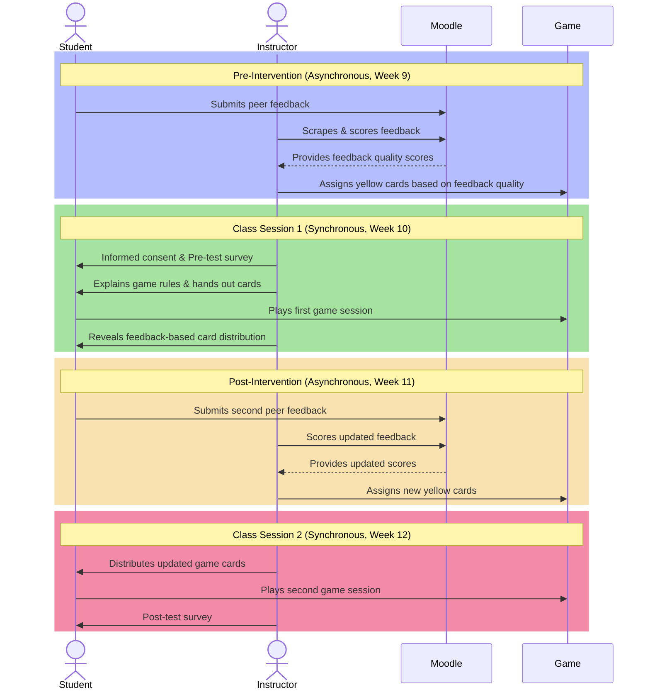

---
{"title":"Methodology","dg-publish":true,"created":"2024-03-06","modified":"2025-03-08","permalink":"/50-works/research/methodology/","dgPassFrontmatter":true,"updated":"2025-03-08"}
---

This study is grounded in existing literature on Peer Code Review (PCR), the application of motivational theories, specifically Self-Determination Theory (SDT), and the use of Game-Based Learning (GBL) in Computer Science (CS) education. It contributes to the field by exploring a novel approach to a persistent challenge in CS education: how to cultivate the student motivation essential for effective PCR and the development of crucial software development skills. Specifically, this study seeks to determine whether a game-based learning intervention increases the quality of feedback provided during CS PCR and whether it influences students' perceived competence, autonomy, and relatedness, as conceptualized by SDT.

## 4.1 Research Design

This study employed a mixed-methods pre-post experimental design to investigate the impact of a GBL intervention on both the quality of feedback provided during CS PCR and students' self-reported motivation in alignment with SDT. The target population consisted of third-year CS students at the CEGEP level in Quebec, selected due to their advanced programming experience and the critical role of PCR in preparing them for collaborative software development practices. The study was conducted within two sections of a Game Programming course in the CS program at John Abbott College, with a sample size of 42 students in the pre-test and 39 students in the post-test for motivation analysis, and 37 students for the analysis of feedback quality. Data collection took place during Week 10 (pre-test) and Week 12 (post-test) of the Fall 2024 semester, allowing for an assessment of changes in student motivation and feedback quality over time. A pre-test/post-test approach was used to assess changes over time within the same group of students rather than comparing two separate groups.

## 4.2 Procedure

The sequence of activities in this study is visually represented in Figure 1, which distinguishes between asynchronous and synchronous phases of the intervention:

### Pre-Intervention Phase

Prior to this study, students had been engaging in peer feedback activities since the early weeks of the semester, using the Peer Code Review Rubric (Appendix A) as a reference for evaluating their peers' work. This rubric provided a structured framework that guided their feedback, ensuring consistency and clarity in their evaluations. These prior experiences with peer review helped establish a baseline understanding of feedback expectations before the intervention was introduced.

Prior to the intervention, students participated in asynchronous peer feedback through Moodle’s Workshop activity [@moodle2024]. Each student provided feedback on their peers’ work, and this feedback was extracted using a custom scraper (Appendix E) developed by the researcher. The extracted feedback was anonymized and analyzed using a Large Language Model (LLM) [@openai2024], which categorized comments based on a Code Review Taxonomy (Appendix B). The taxonomy classifies feedback into distinct categories that reflect specificity and constructiveness, such as "SA" (Strong Actionable), "G+" (General Positive), or "G0" (General Neutral). To quantify the quality of feedback for analysis, each taxonomy category was assigned a numerical score using a predefined conversion system (Table 1). These scores were then used to determine the number of yellow action cards received at the start of the game, introducing a performance-based starting condition for the intervention.

Table 1

Numerical Conversion of Feedback Quality Scores

|Code|Description|Score|
|---|---|---|
|SA|Strong Actionable|5|
|S+/S-|Specific Positive/Negative|4|
|S0|Specific Neutral|3|
|G+/G-/GA|General Positive/Negative/Advice|2|
|G0/PV|General Neutral/Placeholder Value|1|
|OT|Off-topic/Irrelevant|0|

Each student provided feedback on three peers, and the median of these three numerical scores was used as their individual feedback quality score in statistical analysis.

### Intervention Phase

During a synchronous class session, students first completed the informed consent form and the pre-test, which measured perceived competence, autonomy, and relatedness. They were then placed into groups of four and received physical card decks for gameplay. The instructor displayed a table assigning yellow cards to each student, prompting curiosity about the distribution.

Students played the game under standard conditions, engaging with mechanics centered around resource management, strategy, and competition. Since this was a Game Programming course, the entities within the game were all based on fundamental game development concepts. Students aimed to build four key structures—State Machine, Sprite, Timer, and Collision—by collecting and trading resource cards while managing setbacks introduced by special action cards. While the game itself did not directly involve peer feedback, its competitive structure introduced an incentive-based framework that was later linked to students' feedback quality in the debriefing session. After gameplay, it was revealed that the initial yellow card distribution was based on their previous peer feedback quality, emphasizing the relationship between quality feedback and game resources.

### Post-Intervention Phase

Following the first game session, students completed another asynchronous peer feedback activity through Moodle, knowing that their feedback quality would impact their performance in a future game session. The second iteration of the game followed the same structure as the first, with students receiving yellow cards based on their new feedback quality scores. After playing the game for the second time, students completed the post-test survey, measuring changes in their perceptions of competence, autonomy, and relatedness.

## 4.3 Instruments

### Intrinsic Motivation Inventory (IMI)

The IMI is a validated Likert-style survey that measures student motivation in PCR, assessing sub-scales for competence, autonomy, relatedness, and enjoyment. It utilizes a 5-point scale (1 = "not at all true" to 5 = "very true"). Survey questions were adapted to reflect the PCR experience. For example, competence-related questions included statements such as, "I think I am pretty good at peer code review" and "I am satisfied with my ability to assess my peers’ code." Autonomy-related items asked students whether they felt they had choices in how they provided peer feedback or whether they had input in deciding how to evaluate their peers’ work. Relatedness was assessed through questions that explored whether students felt connected to their peers during the peer review process and whether they felt comfortable giving feedback. Enjoyment-focused questions measured whether students found the peer review process enjoyable and whether they had fun participating. The full list of pre-test and post-test survey questions is included in Appendix D to provide a comprehensive view of the assessment instrument.

### Code Review Taxonomy

A Code Review Taxonomy (Hamer et al., 2015; Indriasari et al., 2023) categorized feedback comments into distinct types. Feedback was classified as either positive or negative, depending on whether it reinforced correct implementation or identified issues. Additionally, comments were categorized based on whether they provided actionable advice or suggestions for improvement. The taxonomy also distinguished between general feedback, which addressed broader coding concepts, and code-specific feedback, which focused on particular lines of code or implementation details. These categories provided a structured framework for analyzing feedback quality.

## 4.4 Data Analysis

Data analysis focused on assessing changes between pre and post-test measures, as well as evaluating improvements in peer feedback quality. The Wilcoxon Signed-Rank Test was applied to analyze pre-post differences in feedback quality scores. Each student provided feedback to three peers in both the pre and post-intervention phases. The median feedback quality score from each student's three evaluations was used for the Wilcoxon analysis to account for variability across different peer reviews. To assess changes in perceived competence, autonomy, and relatedness, paired t-tests were conducted on the mean scores of the questions corresponding to each respective SDT motivation sub-scale. Additionally, descriptive statistics such as mean and median scores were calculated for each variable to provide a clearer picture of the trends in student motivation and feedback quality over time.

## 4.5 Ethical Considerations

The researcher’s dual role as instructor and researcher introduced potential concerns regarding coercion. To mitigate this, explicit informed consent was obtained (Appendix C), and students were informed that participation was voluntary, with the option to withdraw at any time. Pre-test and post-test survey responses were anonymous, ensuring that students' self-reported motivation data remained confidential. However, feedback quality data was not anonymized, as it was necessary to track individual students' feedback performance to assign their starting resources in the game-based intervention. The students were informed that their grades were not impacted by their participation. Additionally, the study adhered to institutional ethical guidelines, ensuring that all data was stored securely on Canadian servers using both the Moodle learning management system and Microsoft Forms.
