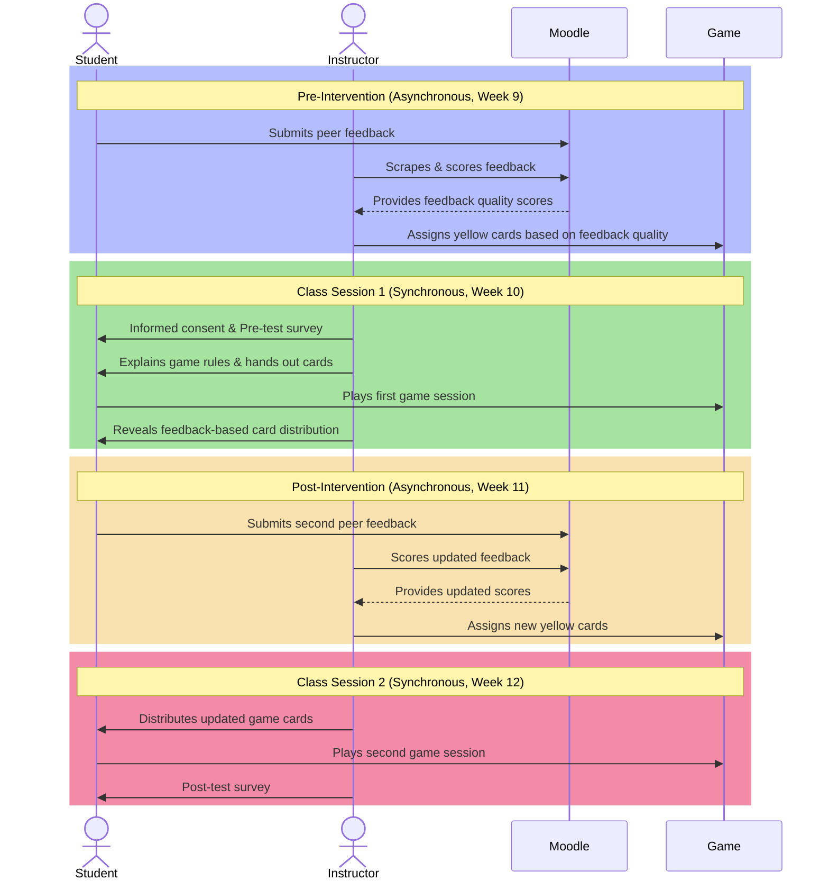

---
{"title":"Research Proposal","created":"2024-04-27","dg-publish":true,"tags":null,"modified":"2024-09-13","permalink":"/50-works/research/research-proposal/","dgPassFrontmatter":true,"updated":"2024-09-13"}
---


## ABSTRACT

## LIST OF TABLES

## LIST OF FIGURES

## LIST OF ACRONYMS

- CS: Computer Science
- PCR: Peer Code Review
- GBL: Games-based Learning
- SDT: Self-Determination Theory
- IMI: Intrinsic Motivation Inventory
- CRT: Code Review Taxonomy

## CHAPTER 1: PROBLEM STATEMENT


<div class="transclusion internal-embed is-loaded"><a class="markdown-embed-link" href="/50-works/research/problem-statement/" aria-label="Open link"><svg xmlns="http://www.w3.org/2000/svg" width="24" height="24" viewBox="0 0 24 24" fill="none" stroke="currentColor" stroke-width="2" stroke-linecap="round" stroke-linejoin="round" class="svg-icon lucide-link"><path d="M10 13a5 5 0 0 0 7.54.54l3-3a5 5 0 0 0-7.07-7.07l-1.72 1.71"></path><path d="M14 11a5 5 0 0 0-7.54-.54l-3 3a5 5 0 0 0 7.07 7.07l1.71-1.71"></path></svg></a><div class="markdown-embed">


PCR is a fundamental part of being a professional software developer [@li2006#p. 9]. This is a process that is done when a developer makes a change or add to the already existing codebase. One or more of their teammates will evaluate and make suggestions on the code based on an agreed upon style guide and general coding best practices. These suggestions include, but are not limited to, variable and function naming conventions, spacing, comments, size and scope of functions. The developer then has to implement the feedback from their peers, often creating a dialogue with the team that leads to uncovering more related issues with the codebase. This process is critical in the quality assurance of the application and is commonly enacted by most software companies. Despite this requirement, the research suggests that students lack motivation to give quality peer feedback during the code review process [@indriasari2021a]. To give quality peer feedback, students must be engaged in the process. The literature states that students learn better by doing than by passively listening [@powell2009] and that students can deepen their own learning through peer assessment [@race2001].

However, despite its numerous benefits, one of the challenges encountered in current PCR practices is the low motivation among CS students in providing quality peer feedback. This lack of motivation can hinder the effectiveness of the PCR process and prevent students from fully reaping the benefits of this collaborative learning experience [@petersen2018]. This can be due to various reasons such as time constraints, lack of incentive, or inadequate understanding of the value of constructive feedback. Additionally, students may feel uncomfortable critiquing their peers' work or may not have the necessary skills to provide meaningful and constructive feedback [@perez-quinones2009].

Another challenge is the potential for biases and conflicts to arise during PCR. Students may struggle to separate personal relationships from professional feedback, leading to tension within the peer group. Furthermore, differences in skill levels and experiences among students can also impact the effectiveness of the PCR process, as it may be difficult for students to provide feedback on code that is significantly more advanced or complex than their own [@indriasari2021].

Lastly, the logistics of organizing and managing PCR sessions can also pose challenges. Coordinating schedules, ensuring equal participation, and providing clear guidelines for the review process can be demanding for educators and may impact the overall quality of the review experience [@indriasari2023].

Addressing these challenges is crucial to enhancing the effectiveness of PCR and maximizing its benefits for CS students. Implementing strategies to motivate students, providing training on giving and receiving constructive feedback, and fostering an inclusive and supportive peer review environment are essential steps towards overcoming these obstacles.


</div></div>


## CHAPTER 2: CONCEPTUAL FRAMEWORK


<div class="transclusion internal-embed is-loaded"><a class="markdown-embed-link" href="/50-works/research/conceptual-framework/" aria-label="Open link"><svg xmlns="http://www.w3.org/2000/svg" width="24" height="24" viewBox="0 0 24 24" fill="none" stroke="currentColor" stroke-width="2" stroke-linecap="round" stroke-linejoin="round" class="svg-icon lucide-link"><path d="M10 13a5 5 0 0 0 7.54.54l3-3a5 5 0 0 0-7.07-7.07l-1.72 1.71"></path><path d="M14 11a5 5 0 0 0-7.54-.54l-3 3a5 5 0 0 0 7.07 7.07l1.71-1.71"></path></svg></a><div class="markdown-embed">


Providing effective code review feedback is a crucial skill for CS students as they prepare to enter the workforce [@sadowski2018]. From my experience as a professional software developer in the industry, I know that PCR is a fundamental skill for programmers. From my experience as a CS student, I know that traditional academic approaches do not always engage or motivate learners especially for the PCR process. On the other end, as a CS teacher, I have seen firsthand how disengaged students can be during PCR sessions. Providing superficial feedback benefits neither the reviewer nor the reviewee. I want to help create a classroom environment where feedback is constructive and where students feel empowered as part of the development process. It is important to create an environment where feedback is constructive and empowers students as part of the development process [@hattie2007]. This is particularly crucial for developing essential skills in professional software developers, such as giving effective feedback during PCR.

This lack of motivation frequently results in surface-level feedback that does little to improve code quality or foster deep learning [@ramsden2003]. This disengagement poses a significant challenge for educators aiming to maximize the effectiveness of PCR practices. The root of this issue may be motivational. SDT provides a potential lens for understanding this phenomenon by highlighting the importance of competence, autonomy, and relatedness for intrinsic motivation [@deci1994]. Traditional PCR processes may fail to adequately support these needs: _competence_, where students may doubt their ability to provide valuable feedback or feel that the focus is solely on error-finding or quality-assurance testing; _autonomy_, where limited choices in how to engage with PCR (code to review, feedback format, etc.) may stifle student ownership; and _relatedness_, where a lack of community focus or a shared sense of purpose can diminish the feeling that PCR is a collaborative improvement process.

GBL offers a promising approach to address these motivational barriers hindering effective PCR. GBL prioritizes immersion, challenge, and (sometimes) social interaction [@papastergiou2009]. These elements have the potential to: _enhance competence_, where well-designed challenges and in-game rewards can build confidence as coding proficiency increases; _foster autonomy_, where GBL systems can offer choices within a structured learning experience, increasing student agency; and _promote relatedness_, where narrative and collaborative gameplay can make PCR feel more purposeful and community-oriented.

As an avid player of both digital and analogue games, I find that my experience in gaming also influences my interest in this topic. In the world of gaming, especially in multiplayer games, communication and teamwork are crucial for success. Similarly, in the area of PCR, effective communication and collaboration are essential for producing high-quality code. Furthermore, the problem-solving and critical thinking skills honed through gaming also translate to the world of programming and code review. The analytical mindset and attention to detail required in gaming parallel the skills needed for thorough code review [@schmitz2011]. Understanding how to engage and motivate students in the context of PCR aligns with the principles of game design, where creating an engaging and immersive experience is paramount. I believe my experience playing games provides me with a unique perspective on the dynamics of PCR and motivates me to delve deeper into this topic.

In this study, I want to examine the quality of PCR feedback and GBL through the lens of student motivation and SDT. Observing the influence of GBL on the quality of feedback provided during PCR will be the key focus of this research. By harnessing the potential of GBL to transform PCR into a more intrinsically motivating, and subsequently, more valuable learning experience, my ultimate goal is to develop GBL interventions that increase student engagement, leading to higher-quality feedback that benefits everyone involved.


</div></div>


## CHAPTER 3: LITERATURE REVIEW


<div class="transclusion internal-embed is-loaded"><a class="markdown-embed-link" href="/50-works/research/literature-review/" aria-label="Open link"><svg xmlns="http://www.w3.org/2000/svg" width="24" height="24" viewBox="0 0 24 24" fill="none" stroke="currentColor" stroke-width="2" stroke-linecap="round" stroke-linejoin="round" class="svg-icon lucide-link"><path d="M10 13a5 5 0 0 0 7.54.54l3-3a5 5 0 0 0-7.07-7.07l-1.72 1.71"></path><path d="M14 11a5 5 0 0 0-7.54-.54l-3 3a5 5 0 0 0 7.07 7.07l1.71-1.71"></path></svg></a><div class="markdown-embed">

<div class="markdown-embed-title">

# Literature Review

</div>


## 3.1 The Importance of PCR

Peer code review (PCR) is one of the best ways for students to learn programming beyond simply writing their own code. It teaches them how to analyze and critique someone else’s work, which, in turn, makes them better at spotting mistakes in their own. This process is common in professional software development, where developers review and critique each other’s code regularly [@cross1987; @indriasari2020a]. In the classroom, PCR helps students understand coding standards, best practices, and software design principles. But it’s not only about technical skills. Students also practice communicating their ideas, justifying their decisions, and learning from different approaches to the same problem [@indriasari2020a; @petersen2018].

There’s a lot to gain from seeing how someone else thinks through a problem. Students might realize that there’s a simpler way to solve something or that they have been making the same mistake without noticing. Reviewing peer code pushes them to ask, “Why did they do it this way?” and “Would my approach be better?” This kind of critical thinking strengthens problem-solving skills and helps them adapt to new programming concepts [@indriasari2020a; @perez-quinones2009]. It also helps them recognize patterns such as common errors, smart solutions, and efficient techniques they might not have encountered otherwise [@li2006; @petersen2018].

PCR also builds self-awareness, helping students reflect on their own coding habits as they critique their peers’ work. Seeing mistakes or alternative approaches in someone else’s code can prompt students to ask whether they are making similar errors or if they could structure their own code more effectively [@brown2020]. This reflective process reinforces their understanding of key programming concepts, as articulating feedback requires them to evaluate and explain their reasoning clearly [@hamer2009; @hundhausen2013]. Additionally, knowing that their own work will be reviewed by peers makes students more deliberate in their coding decisions, leading to clearer, better-documented programs. Over time, this process fosters accountability and a sense of ownership over their work, preparing them for the expectations of professional software development [@hamer2009; @indriasari2020a].

## 3.2 The Motivational Challenge

Encouraging CS students to engage meaningfully in PCR presents a challenge. Research indicates that peer reviews often lack depth and specificity, with students providing feedback that is brief, uncritical, or superficial—falling short of instructor expectations [@indriasari2020a; @indriasari2021a]. Many students see peer review as a routine task rather than an opportunity for learning, which limits its potential benefits. While gamification has been shown to increase participation, studies suggest it does not necessarily improve the depth or usefulness of feedback [@khandelwal2017]. This underscores the need for strategies that not only encourage participation but also ensure that students provide thoughtful, constructive feedback. In programming courses, where well-executed peer feedback can significantly enhance learning, motivating students to engage deeply in PCR is especially important.

Self-Determination Theory (SDT) offers insight into why students may struggle to engage fully in PCR. According to SDT, intrinsic motivation is strongest when three core psychological needs are met: **competence**, **autonomy**, and **relatedness** [@deci1994]. When students feel capable, in control of their learning, and connected to their peers, they are more likely to find PCR valuable and invest effort willingly. Applying SDT to peer review can help identify ways to foster intrinsic motivation, ensuring that students engage not just for external incentives but because they see meaning in the process itself.

**Competence** refers to the need to feel capable and effective in a task. In PCR, students are more likely to provide meaningful feedback when they feel confident in their ability to understand and evaluate code [@bandura2012]. Those who doubt their programming or review skills may hesitate to offer substantive feedback, leading to shallow assessments. Conversely, students who develop confidence in analyzing code and identifying issues tend to engage more deeply in the review process. Strengthening this sense of competence can be achieved through training, structured review exercises, and guided practice. Research suggests that when students feel prepared and knowledgeable, they are more willing to participate in PCR and contribute meaningfully [@indriasari2020a].

**Autonomy** is the need to have control and choice in one's actions. In educational settings, students are more intrinsically motivated when they have some say in how they engage with a task. In PCR, autonomy can be supported by allowing students to choose whose code they review or providing flexibility in how they structure their feedback. When students feel trusted to make decisions in the peer review process, they develop a stronger sense of ownership and responsibility [@pintrich2003]. Even small choices, such as selecting which aspects of the code to focus on (style, correctness, efficiency, etc.), can enhance motivation. Prior research indicates that when learners perceive autonomy in academic tasks, their engagement increases [@indriasari2021a].

**Relatedness** refers to the need to feel connected to others and part of a learning community. PCR fosters relatedness through its collaborative nature, as students engage in reviewing each other’s work, often leading to discussions and shared learning experiences. When the classroom environment promotes trust and cooperation, students are more likely to see peer review as a meaningful, collective effort rather than an isolated requirement. This sense of connection can strengthen motivation, as students recognize that their feedback has value and that they, in turn, benefit from their peers' insights [@powell2009]. A supportive peer review culture, where students feel respected and comfortable giving and receiving feedback, may reinforce relatedness. In contrast, if PCR is conducted in an impersonal or competitive atmosphere, students may disengage to avoid criticism [@indriasari2023].

Addressing these three psychological needs, **competence, autonomy, and relatedness**, could be key to overcoming motivational barriers in PCR. In practice, this means equipping students with the skills and tools to feel **competent** in reviewing code through workshops, clear rubrics, and structured practice, supporting **autonomy** by allowing flexibility in the review process, and fostering **relatedness** through peer discussions and a collaborative classroom culture. When students feel capable, self-directed, and connected, they are more likely to engage deeply in peer review, producing thoughtful feedback and gaining more from the process [@brown2020]. This SDT perspective frames the exploration of game-based approaches as a potential strategy for improving motivation in PCR.

## 3.3 Gamification vs. Game-Based Learning

Two pedagogical approaches have gained attention for enhancing student motivation through game elements: **gamification** and **game-based learning (GBL)**. While both incorporate game concepts into education, they do so in distinct ways. **Gamification** adds game-like features to a non-game activity, whereas **GBL** turns the learning process into a game itself [@jayasinghe2013; @al-azawi2016]. In the context of PCR, gamification might involve awarding points or badges for completed reviews, while GBL could transform peer review into an interactive game experience.

In education, gamification typically involves introducing elements such as points, badges, leaderboards, levels, or timed challenges to make coursework more engaging. The key distinction is that students are not playing a game related to the subject matter; instead, traditional learning tasks like quizzes, assignments, or peer reviews are layered with an external reward system inspired by games [@jayasinghe2013]. This approach primarily drives **extrinsic motivation**, where students are encouraged to participate in order to earn rewards or avoid penalties rather than out of genuine interest in the task. For example, students may be more inclined to complete peer reviews if doing so earns them points or a higher leaderboard ranking. While gamified peer review systems can lead to an increase in the number of reviews and bug identifications, the quality of comments may not significantly improve, suggesting that extrinsic rewards alone are insufficient for fostering meaningful engagement [@khandelwal2017].

Studies suggest that gamification can positively influence student motivation and participation. In higher education, integrating points and badges into learning activities has been linked to increased student engagement and time spent on tasks [@goshevski2017; @llorens-largo2016; @oktaviati2018]. In CS education specifically, gamification has been associated with higher enthusiasm and persistence. For example, when game elements were added to a peer review system in a programming course, students showed greater willingness to participate in PCR than in a non-gamified setting [@indriasari2023].

Gamifying PCR can take various forms. One approach is to use a dedicated platform that tracks and rewards peer review contributions. Students might earn points for each piece of feedback they provide, unlock badges for reviewing a certain number of peers or identifying critical issues, and see their progress on a class leaderboard [@khandelwal2017]. These systems introduce elements of competition and achievement, making the peer review process more engaging. Researchers have tested these ideas, demonstrating that incorporating challenges and progression levels into PCR increased both the quantity and certain aspects of the quality of student feedback [@indriasari2021a].

While gamification effectively encourages participation, it primarily relies on extrinsic motivation—rewarding specific behaviours to drive engagement. This approach has clear short-term benefits, as students tend to respond positively to rewards and competitive elements. However, a key limitation is that motivation may decline once the rewards are removed or if the novelty fades. This raises the question of whether gamification should be supplemented with or balanced by strategies that foster deeper, intrinsic motivation.

GBL takes a different approach by making a _game_ the central medium for learning. In GBL, students engage with an educational game specifically designed to teach or reinforce key concepts and skills [@al-azawi2016]. Instead of earning points for completing a conventional task, their learning is embedded within a game narrative or challenge. This shifts the motivation from external rewards to the inherent enjoyment, curiosity, and challenge of the game itself, aligning closely with **intrinsic motivation**. A well-designed educational game keeps students engaged because they want to play, and in the process, they naturally develop the target skills. In PCR, a GBL approach might involve a scenario-based game where students take on roles like “code detective” or “software team leader” and must conduct peer reviews to advance in the story or solve a puzzle. Students who engage with a structured, game-based approach to PCR have been shown to increase knowledge retention and confidence in performing code reviews [@ardic2021]. Here, code review is not a separate assignment but an integral part of an engaging game experience.

Game-based learning has been successfully applied in various areas of computer science education. Educators have developed games to teach programming concepts, algorithms, data structures, and software engineering principles [@schmitz2011; @videnovik2023]. These range from simple quiz-based games to complex simulations and narrative-driven challenges. By interacting with these games, students can explore complex topics in a low-pressure environment. For instance, a game might allow students to visually manipulate algorithms or debug a program in a playful setting, making abstract concepts more concrete. Playing educational games also fosters **critical thinking and problem-solving**, as students must apply their knowledge to navigate in-game challenges. Additionally, **collaboration** is often a key element, particularly in multiplayer coding games where students review each other’s code to progress together. This naturally integrates PCR into the gameplay, reinforcing learning through interactive peer engagement. Because GBL packages learning as an enjoyable challenge, students may be more motivated to tackle difficult topics [@papastergiou2009; @goshevski2017].

One major strength of GBL is its ability to bridge theory and practice. Games often simulate real-world scenarios, requiring students to apply theoretical knowledge to achieve success [@chiang2011; @jayasinghe2013]. This makes abstract concepts more tangible and relevant. For example, a game designed to teach secure coding might challenge players to fix vulnerabilities in a series of programs to prevent a simulated cyberattack. In this context, students are not just learning about security concepts but actively applying them in a way that mirrors real-world challenges. Additionally, GBL can leverage storytelling and narrative elements to create immersive learning experiences. A mundane task can be transformed into an engaging adventure, such as a peer review mission where students help a team of stranded programmers debug their code. This type of narrative framing gives purpose to the PCR process within the game world, making it more compelling. When students become invested in the game’s outcome, they are also more engaged in the learning activities required to progress. Unlike gamification, where motivation is often tied to external rewards, GBL fosters **deep engagement** by making learning an enjoyable and immersive experience [@al-azawi2016; @papastergiou2009].

Research increasingly supports GBL as an effective tool for student engagement. Studies have shown that students learning through games often perform better than those in traditional settings, not necessarily due to differences in content but because game-based environments lead to greater engagement and time-on-task [@lopez-fernandez2021]. Students frequently describe educational games as more enjoyable and can enter a state of **flow**, where they are fully absorbed in problem-solving and learning. The interactive nature of games, which provides immediate feedback, helps sustain this engagement by allowing students to see the results of their decisions in real time. Additionally, the social dynamics of many games, whether competitive or cooperative, further enhance motivation. Students may compete against one another or collaborate to achieve a shared goal, reinforcing a sense of **relatedness** that supports deeper learning. Overall, GBL creates an adaptive, dynamic learning environment that provides instant rewards in the form of progress, keeps students engaged through entertainment value, and sustains motivation over time [@videnovik2023]. These qualities make GBL a promising approach for addressing challenges in peer code review.

## 3.4 The Potential of Game-Based Learning

Computer science education has seen extensive research on gamification, but far less focus on full game-based learning approaches. Studies have examined the impact of game-like elements such as points, badges, and leaderboards on student engagement, with findings suggesting that gamification can lead to short-term increases in participation and modest improvements in learning outcomes when applied effectively [@mohamedmasrop2019]. The literature reveals that while gamification of PCR has been attempted (albeit in only a handful of studies), using an actual game for PCR has received little attention. Ardıç [-@ardic2021] is one of the few studies to explore a game-based approach to teaching code review, though their focus was primarily on introducing students to the process rather than investigating its impact on peer feedback quality.

Peer code review has the potential to be more effective if student motivation can be improved. While the practice itself provides clear benefits for skill development, its success in an educational setting depends on students’ willingness to engage actively. Self-Determination Theory suggests that structuring PCR to support students' feelings of competence, autonomy, and relatedness should foster intrinsic motivation and lead to better outcomes. Traditional methods for increasing PCR participation, such as grading participation or relying on peer pressure, focus on extrinsic motivators and have limited long-term impact.

Gamification has been explored as a way to enhance engagement in PCR. Studies show that adding game elements can increase participation and introduce a level of competition that keeps students involved [@indriasari2020a; @indriasari2023]. However, gamification primarily drives **extrinsic motivation**, where students may focus on earning points or climbing leaderboards rather than developing high-quality feedback skills. Research has shown that while gamification can lead to more reviews being completed, it does not always improve the depth or usefulness of those reviews [@khandelwal2017]. This raises concerns about whether gamification alone is sufficient for fostering meaningful engagement in PCR or if a more immersive, intrinsically motivating approach like GBL may be necessary.

A GBL approach to PCR could naturally promote deeper engagement by making the peer review process enjoyable in its own right. Unlike gamification, where motivation often stems from external rewards, GBL fosters **intrinsic motivation** by emphasizing enjoyment, immersion, and challenge. When students are absorbed in a game-based peer review activity, their engagement comes from the experience itself rather than a desire to earn points or climb a leaderboard. This raises the question of whether GBL might be more effective than gamification in cultivating the type of motivation that leads to high-quality feedback.

If students find a code review game genuinely engaging or intellectually stimulating, they are likely to focus on overcoming challenges—such as analyzing and critiquing code—because they want to progress in the game. This could turn PCR from a routine task into a compelling activity, naturally encouraging more thoughtful and thorough feedback. Research suggests that motivation is strongest when students see a task as something they _want_ to do rather than something they _have_ to do for a reward [@khandelwal2017]. This perspective drives the exploration of GBL for PCR: a well-designed educational game may sustain motivation more effectively than a gamified system and lead to higher-quality engagement in peer review.

Despite its strong theoretical potential, the combination of GBL and PCR remains largely unexplored in existing research. Most studies on enhancing peer code review through game elements have focused on gamification, such as adding points and badges or comparing sections with and without gamified incentives. These studies suggest that gamification can be an effective engagement tool, but they also leave open the possibility that a more immersive approach could yield better results. While gamification of PCR has been examined in a limited number of studies, there is no documented research on using a full **game-based learning** approach for peer code review.

This presents a **significant gap** in the literature. Although GBL has been shown to improve motivation and learning outcomes in other educational contexts, its impact on PCR has yet to be studied. Given that peer review requires sustained engagement and critical thinking, it stands to reason that an intrinsically motivating approach like GBL could enhance the process. Without empirical research in this area, educators are missing evidence on a potentially transformative method for improving student participation and feedback quality in peer code review.

Recognizing this gap, the present literature review highlights the need for research that applies GBL to PCR in CS education. If future studies demonstrate that embedding peer review within a game environment leads to increased engagement and higher-quality feedback, it could open new possibilities for enhancing learning in programming courses. Such findings could support the development of specialized educational games or platforms that merge the pedagogical benefits of PCR with the motivational impact of games.

Exploring GBL in PCR aligns with the broader goal of fostering **intrinsic motivation** in learners. If GBL proves to be more effective than traditional methods or simple gamification, it could significantly enhance the effectiveness of PCR as a learning tool. This study aims to address this gap by investigating whether a game-based learning strategy can improve both student motivation and the quality of peer feedback in a CS course. By doing so, we seek to contribute empirical evidence on whether GBL provides a meaningful advantage over gamification in engaging students in high-quality peer code review.


</div></div>


## CHAPTER 4: METHODOLOGY


<div class="transclusion internal-embed is-loaded"><a class="markdown-embed-link" href="/50-works/research/methodology/" aria-label="Open link"><svg xmlns="http://www.w3.org/2000/svg" width="24" height="24" viewBox="0 0 24 24" fill="none" stroke="currentColor" stroke-width="2" stroke-linecap="round" stroke-linejoin="round" class="svg-icon lucide-link"><path d="M10 13a5 5 0 0 0 7.54.54l3-3a5 5 0 0 0-7.07-7.07l-1.72 1.71"></path><path d="M14 11a5 5 0 0 0-7.54-.54l-3 3a5 5 0 0 0 7.07 7.07l1.71-1.71"></path></svg></a><div class="markdown-embed">


This study is grounded in existing literature on Peer Code Review (PCR), the application of motivational theories—specifically Self-Determination Theory (SDT)—to education, and the use of Game-Based Learning (GBL) in Computer Science (CS) education. It contributes to the field by exploring a novel approach to a persistent challenge in CS education: how to cultivate the student motivation essential for effective PCR and the development of crucial software development skills. Specifically, this study seeks to determine whether a game-based learning intervention increases the quality of feedback provided during CS PCR and whether it influences students' perceived competence, autonomy, and relatedness, as conceptualized by SDT.

## 4.1 Research Design

This study employed a mixed-methods pre-post experimental design to investigate the impact of a GBL intervention on both the quality of feedback provided during CS PCR and students' self-reported motivation in alignment with SDT. The target population consisted of third-year CS students at the CEGEP level in Quebec, selected due to their advanced programming experience and the critical role of PCR in preparing them for collaborative software development practices. The study was conducted within two sections of a Game Programming course in the CS program at John Abbott College, with a sample size of 42 students in the pre-test and 39 students in the post-test for motivation analysis, and 37 students for the analysis of feedback quality. Data collection took place during Week 10 (pre-test) and Week 12 (post-test) of the Fall 2024 semester, allowing for an assessment of changes in student motivation and feedback quality over time. A pre-test/post-test approach was used to assess changes over time within the same group of students rather than comparing two separate groups.

## 4.2 Procedure

The sequence of activities in this study is visually represented in Figure 1, which distinguishes between asynchronous and synchronous phases of the intervention:




### Pre-Intervention Phase

Prior to this study, students had been engaging in peer feedback activities since the early weeks of the semester, using the Peer Code Review Rubric (Appendix A) as a reference for evaluating their peers' work. This rubric provided a structured framework that guided their feedback, ensuring consistency and clarity in their evaluations. These prior experiences with peer review helped establish a baseline understanding of feedback expectations before the intervention was introduced.

Prior to the intervention, students participated in asynchronous peer feedback through Moodle’s Workshop activity [@moodle2024]. Each student provided feedback on their peers’ work, and this feedback was extracted using a custom scraper (Appendix E) developed by the researcher. The feedback was anonymized and analyzed using a Large Language Model (LLM) [@openai2024], which categorized comments based on a Code Review Taxonomy (Appendix B). These categorized scores were then converted into numerical values through a JavaScript-based scoring script (Appendix F). The scores determined the number of yellow action cards that each student received at the beginning of the game, introducing a performance-based starting condition for the intervention.

### Intervention Phase

During a synchronous class session, students first completed the informed consent form and the pre-test, which measured perceived competence, autonomy, and relatedness. They were then placed into groups of four and received physical card decks for gameplay. The instructor displayed a table assigning yellow cards to each student, prompting curiosity about the distribution.

Students played the game under standard conditions, engaging with mechanics centered around resource management, strategy, and competition. Since this was a Game Programming course, the entities within the game were all based on fundamental game development concepts. Students aimed to build four key structures—State Machine, Sprite, Timer, and Collision—by collecting and trading resource cards while managing setbacks introduced by special action cards. While the game itself did not directly involve peer feedback, its competitive structure introduced an incentive-based framework that was later linked to students' feedback quality in the debriefing session. After gameplay, it was revealed that the initial yellow card distribution was based on their previous peer feedback quality, emphasizing the relationship between quality feedback and game resources.

### Post-Intervention Phase

Following the first game session, students completed another asynchronous peer feedback activity through Moodle, knowing that their feedback quality would impact their performance in a future game session. The second iteration of the game followed the same structure as the first, with students receiving yellow cards based on their new feedback quality scores. After playing the game for the second time, students completed the post-test survey, measuring changes in their perceptions of competence, autonomy, and relatedness.

## 4.3 Instruments

### Intrinsic Motivation Inventory (IMI)

The IMI is a validated Likert-style survey that measures student motivation in PCR, assessing sub-scales for competence, autonomy, relatedness, and enjoyment. It utilizes a 5-point scale (1 = "not at all true” to 5 = "very true"). Survey questions were adapted to reflect the PCR experience. For example, competence-related questions included statements such as, "I think I am pretty good at peer code review" and "I am satisfied with my ability to assess my peers’ code." Autonomy-related items asked students whether they felt they had choices in how they provided peer feedback or whether they had input in deciding how to evaluate their peers’ work. Relatedness was assessed through questions that explored whether students felt connected to their peers during the peer review process and whether they felt comfortable giving feedback. Enjoyment-focused questions measured whether students found the peer review process enjoyable and whether they had fun participating. The full list of pre-test and post-test survey questions is included in Appendix D to provide a comprehensive view of the assessment instrument.

### Code Review Taxonomy

A Code Review Taxonomy (Hamer et al., 2015; Indriasari et al., 2023) categorized feedback comments into distinct types. Feedback was classified as either positive or negative, depending on whether it reinforced correct implementation or identified issues. Additionally, comments were categorized based on whether they provided actionable advice or suggestions for improvement. The taxonomy also distinguished between general feedback, which addressed broader coding concepts, and code-specific feedback, which focused on particular lines of code or implementation details. These categories provided a structured framework for analyzing feedback quality.

## 4.4 Data Analysis

Data analysis focused on assessing changes between preand post-test measures, as well as evaluating improvements in peer feedback quality. The Wilcoxon Signed-Rank Test was applied to analyze pre-post differences in feedback quality scores. Each student provided feedback to three peers in both the preand post-intervention phases. The median feedback quality score from each student's three evaluations was used for the Wilcoxon analysis to account for variability across different peer reviews. To assess changes in perceived competence, autonomy, and relatedness, paired t-tests were conducted. Additionally, descriptive statistics such as mean and median scores were calculated for each variable to provide a clearer picture of the trends in student motivation and feedback quality over time.

Students who were absent from either the pre-test or post-test were excluded from the analysis of feedback quality, as their responses could not be matched across both time points. However, all responses were retained for the motivation analysis since those measures were unpaired and anonymous.

## 4.5 Ethical Considerations

The researcher’s dual role as instructor and researcher introduced potential concerns regarding coercion. To mitigate this, explicit informed consent was obtained (Appendix C), and students were informed that participation was voluntary, with the option to withdraw at any time. Pre-test and post-test survey responses were anonymous, ensuring that students' self-reported motivation data remained confidential. However, feedback quality data was not anonymized, as it was necessary to track individual students' feedback performance to assign their starting resources in the game-based intervention. The students were informed that their grades were not impacted by their participation. Additionally, the study adhered to institutional ethical guidelines, ensuring that all data was stored securely on Canadian servers using both Moodle and Microsoft Forms.


</div></div>


## CHAPTER 5: CLOSING STATEMENT

## Appendix A: PCR RUBRIC

==Replace with clean code rubric==

## Appendix B: CODE REVIEW TAXONOMY


<div class="transclusion internal-embed is-loaded"><a class="markdown-embed-link" href="/50-works/research/code-review-taxonomy/" aria-label="Open link"><svg xmlns="http://www.w3.org/2000/svg" width="24" height="24" viewBox="0 0 24 24" fill="none" stroke="currentColor" stroke-width="2" stroke-linecap="round" stroke-linejoin="round" class="svg-icon lucide-link"><path d="M10 13a5 5 0 0 0 7.54.54l3-3a5 5 0 0 0-7.07-7.07l-1.72 1.71"></path><path d="M14 11a5 5 0 0 0-7.54-.54l-3 3a5 5 0 0 0 7.07 7.07l1.71-1.71"></path></svg></a><div class="markdown-embed">

<div class="markdown-embed-title">

# Code Review Taxonomy

</div>


- **S+**: Comments in this category provided positive feedback about a specific element of the code.
- **S−**: Comments in this category provided specific negative feedback about the functionality, style or correctness of the program.
- **S0**: Comments in this category were specific, but were not obviously positive or negative in tone.
- **SA**: Comments in this category provided specific advice to a student about how to improve their code.
- **G+**: Comments in this category are general comments that are positive. The comments do not relate to a specific element of style or requirement specified in the assignment.
- **G−**: Comments in this category are general negative comments. They do not refer to any specific elements of code, but are instead comments directed at the overall quality (summary comments).
- **G0**: Comments in this category are general comments that do not have either positive or negative connotations.
- **GA**: Comments in this category provided general advice to peers, but did not refer to specifics within the code.
- **PV**: Comments in this category were personal in tone in that they recognised that the comments, although being about a submission, were directed to another person. Many of these were combined with one of the other categories, linked with a general or specific criticism.
- **OT**: Comments in this category were off-topic.


</div></div>


## Appendix C: CONSENT FORM


<div class="transclusion internal-embed is-loaded"><a class="markdown-embed-link" href="/50-works/research/consent-form/" aria-label="Open link"><svg xmlns="http://www.w3.org/2000/svg" width="24" height="24" viewBox="0 0 24 24" fill="none" stroke="currentColor" stroke-width="2" stroke-linecap="round" stroke-linejoin="round" class="svg-icon lucide-link"><path d="M10 13a5 5 0 0 0 7.54.54l3-3a5 5 0 0 0-7.07-7.07l-1.72 1.71"></path><path d="M14 11a5 5 0 0 0-7.54-.54l-3 3a5 5 0 0 0 7.07 7.07l1.71-1.71"></path></svg></a><div class="markdown-embed">


## Purpose

This project is being conducted by Vikram Singh, a Computer Science Teacher at John Abbott College, for the completion of a Master's Degree in College Teaching, accredited by the Université de Sherbrooke. This study explores how different approaches to peer code review affect student motivation and feedback quality.

## Procedure

1. Before beginning the activity, you'll complete a short survey regarding your perspectives on peer feedback.
2. You will participate in a brief card game related to your course material.
3. After the card game, you'll complete a survey about your experience.
4. Your feedback on the course assignments, along with survey responses, will be analyzed to better understand factors influencing feedback quality and student motivation in peer code review.

## Potential Risks & Benefits

There are no known risks for participation in this study.

By investigating what makes peer code review motivating (or not), your participation could lead to the design of interventions that make peer code review a more engaging and beneficial process for everyone. Your participation could help students develop stronger feedback skills, crucial for both their success in CS courses and future careers. The findings could provide valuable information to your instructor and others about how to refine peer code review practices, potentially leading to widespread changes that enhance the learning experience for many CS students. For your interest, the results of the study will be sent to you after the study has been completed, if so desired.

## Confidentiality

Your participation in this study is confidential in the following ways:

1. Your name will not appear in the research results.
2. The researcher/teacher will never know if you agree or do not agree to participate in this study, therefore the choice to participate or not has no impact on your final grade, nor on any future interaction with your teacher.
3. The survey results will be anonymous and kept for five years in Microsoft OneDrive behind two-factor authentication.
4. The Microsoft Forms questionnaire will be completed anonymously and your personal information will not be revealed. The servers for Microsoft Forms and OneDrive are stored in Canada and therefore your data is protected by Canadian laws.

Your participation in this research is completely voluntary. You have the right to not consent or withdraw consent at any time. If you have any questions about the content or methods of this study, please feel free to contact the teacher/researcher, Vikram Singh, at [vikram.singh@johnabbott.qc.ca](mailto:vikram.singh@johnabbott.qc.ca) or the supervisor, Paul Darvasi, at [paul.darvasi@usherbrooke.ca](mailto:paul.darvasi@usherbrooke.ca).

If you have any questions about your rights or treatment during this study, please contact the Research and Innovation Officer at JAC, Teresa Hackett, at [teresa.hackett@johnabbott.qc.ca](mailto:teresa.hackett@johnabbott.qc.ca).

## Statement of Consent

I attest that I have read the above information and freely consent to participate in the study on peer code review within the context of my 420-5P6 Game Programming course during the Fall 2024 semester at John Abbott College. I understand that my peer feedback data from the course assignments, which may include identifiable information, will be used to facilitate the card game activity and subsequent analysis. I also acknowledge that while this data may be referenced during the activity, my name or any other personal identifiers will not appear in the final research report.

- Student Name
- Student ID
- Date

I wish to receive the results of the study. My email is:


</div></div>


## Appendix D: INTRINSIC MOTIVATION INVENTORY


<div class="transclusion internal-embed is-loaded"><a class="markdown-embed-link" href="/50-works/research/intrinsic-motivation-inventory/" aria-label="Open link"><svg xmlns="http://www.w3.org/2000/svg" width="24" height="24" viewBox="0 0 24 24" fill="none" stroke="currentColor" stroke-width="2" stroke-linecap="round" stroke-linejoin="round" class="svg-icon lucide-link"><path d="M10 13a5 5 0 0 0 7.54.54l3-3a5 5 0 0 0-7.07-7.07l-1.72 1.71"></path><path d="M14 11a5 5 0 0 0-7.54-.54l-3 3a5 5 0 0 0 7.07 7.07l1.71-1.71"></path></svg></a><div class="markdown-embed">


## Scale Description

The Intrinsic Motivation Inventory (IMI) is a multidimensional measurement device intended to assess participants' subjective experience related to a target activity in laboratory experiments. It has been used in several experiments related to intrinsic motivation and self-regulation (e.g., Ryan, 1982; Ryan, Mims & Koestner, 1983; Plant & Ryan, 1985; Ryan, Connell, & Plant, 1990; Ryan, Koestner & Deci, 1991; Deci, Eghrari, Patrick, & Leone, 1994). The instrument assesses participants' interest/enjoyment, perceived competence, effort, value/usefulness, felt pressure and tension, and perceived choice while performing a given activity, thus yielding six subscale scores. Recently, a seventh subscale has been added to tap the experiences of relatedness, although the validity of this subscale has yet to be established. The **interest/enjoyment subscale is considered the self-report measure of intrinsic motivation**; thus, although the overall questionnaire is called the Intrinsic Motivation Inventory, it is only the one subscale that assesses intrinsic motivation, per se. As a result, the interest/enjoyment subscale often has more items on it that do the other subscales. The perceived choice and perceived competence concepts are theorized to be positive predictors of both self-report and behavioral measures of intrinsic motivation, and pressure/tension is theorized to be a negative predictor of intrinsic motivation. Effort is a separate variable that is relevant to some motivation questions, so is used it its relevant. The value/usefulness subscale is used in internalization studies (e.g., Deci et al, 1994), the idea being that people internalize and become self-regulating with respect to activities that they experience as useful or valuable for themselves. Finally, the relatedness subscale is used in studies having to do with interpersonal interactions, friendship formation, and so on.

The IMI consists of varied numbers of items from these subscales, all of which have been shown to be factor analytically coherent and stable across a variety of tasks, conditions, and settings. The general criteria for inclusion of items on subscales have been a factor loading of at least 0.6 on the appropriate subscale, and no cross loadings above 0.4. Typically, loadings substantially exceed these criteria. Nonetheless, we recommend that investigators perform their own factor analyses on new data sets. Past research suggests that order effects of item presentation appear to be negligible, and the inclusion or exclusion of specific subscales appears to have no impact on the others. Thus, it is rare that all items have been used in a particular experiment. Instead, experimenters have chosen the subscales that are relevant to the issues they are exploring.

The IMI items have often been modified slightly to fit specific activities. Thus, for example, an item such as "I tried very hard to do well at this activity" can be changed to "I tried very hard to do well on these puzzles" or "...in learning this material" without effecting its reliability or validity. As one can readily tell, there is nothing subtle about these items; they are quite face-valid. However, in part, because of their straightforward nature, caution is needed in interpretation. We have found, for example, that correlations between self-reports of effort or interest and behavioral indices of these dimensions are quite modest--often around 0.4. Like other self-report measures, there is always the need to appropriately interpret how and why participants report as they do. Egoinvolvements, self-presentation styles, reactance, and other psychological dynamics must be considered. For example, in a study by Ryan, Koestner, and Deci (1991), we found that when participants were ego involved, the engaged in pressured persistence during a free choice period and this behavior did not correlate with the self-reports of interest/enjoyment. In fact, we concluded that to be confident in one's assessment of intrinsic motivation, one needs to find that the free-choice behavior and the self-reports of interest/enjoyment are significantly correlated.

Another issue is that of redundancy. Items within the subscales overlap considerably, although randomizing their presentation makes this less salient to most participants. Nonetheless, shorter versions have been used and been found to be quite reliable. The incremental R for every item above 4 for any given factor is quite small.

Still, it is very important to recognize that multiple item subscales consistently outperform single items for obvious reasons, and they have better external validity.

On The Scale page, there are five sections. First, the full 45 items that make up the 7 subscales are shown, along with information on constructing your own IMI and scoring it. Then, there are four specific versions of the IMI that have been used in past studies. This should give you a sense of the different ways it has been used. These have different numbers of items and different numbers of subscales, and they concern different activities. First, there is a standard, 22-item version that has been used in several studies, with four subscales: interest/ enjoyment, perceived competence, perceived choice, and pressure/tension. Second, there is a short 9-item version concerned with the activity of reading some text material; it has three subscales: interest/enjoyment, perceived competence, and pressure/tension. Then, there is the 25-item version that was used in the internalization study, including the three subscales of value/usefulness, interest/enjoyment, and perceived choice. Finally, there is a 29-item version of the interpersonal relatedness questionnaire that has five subscales: relatedness, interest/enjoyment, perceived choice, pressure/tension, and effort.

Finally, McAuley, Duncan, and Tammen (1987) did a study to examine the validity of the IMI and found strong support for its validity.

### References

Deci, E. L., Eghrari, H., Patrick, B. C., & Leone, D. (1994). Facilitating internalization: The selfdetermination theory perspective. _Journal of Personality_, _62_, 119-142.

McAuley, E., Duncan, T., & Tammen, V. V. (1987). Psychometric properties of the Intrinsic Motivation Inventory in a competitive sport setting: A confirmatory factor analysis. _Research Quarterly for Exercise and Sport, 60,_ 48-58.

Plant, R. W., & Ryan, R. M. (1985). Intrinsic motivation and the effects of self-consciousness, selfawareness, and ego-involvement: An investigation of internally-controlling styles. _Journal of Personality_, _53_, 435-449.

Ryan, R. M. (1982). Control and information in the intrapersonal sphere: An extension of cognitive evaluation theory. _Journal of Personality and Social Psychology_, _43_, 450-461.

Ryan, R. M., Connell, J. P., & Plant, R. W. (1990). Emotions in non-directed text learning. _Learning and Individual Differences_, _2_, 1-17.

Ryan, R. M., Koestner, R., & Deci, E. L. (1991). Varied forms of persistence: When free-choice behavior is not intrinsically motivated. _Motivation and Emotion_, _15_, 185-205.

Ryan, R. M., Mims, V., & Koestner, R. (1983). Relation of reward contingency and interpersonal context to intrinsic motivation: A review and test using cognitive evaluation theory. _Journal of Personality and Social Psychology_, _45_, 736-750.

## The Scales

THE POST-EXPERIMENTAL INTRINSIC MOTIVATION INVENTORY

(Below are listed all 45 items that can be used depending on which are needed.)

For each of the following statements, please indicate how true it is for you, using the following scale:

```
         1    2    3    4    5    6    7
not at all true | somewhat true | very true
```

### Interest/Enjoyment

- I enjoyed doing this activity very much.
- This activity was fun to do.
- I thought this was a boring activity. (R)
- This activity did not hold my attention at all. (R)
- I would describe this activity as very interesting. I thought this activity was quite enjoyable.
- While I was doing this activity, I was thinking about how much I enjoyed it.

### Perceived Competence

- I think I am pretty good at this activity.
- I think I did pretty well at this activity, compared to other students. After working at this activity for awhile, I felt pretty competent.
- I am satisfied with my performance at this task. I was pretty skilled at this activity.
- This was an activity that I couldn't do very well. (R)

### Effort/Importance

- I put a lot of effort into this.
- I didn't try very hard to do well at this activity. (R)
- I tried very hard on this activity.
- It was important to me to do well at this task. I didn't put much energy into this. (R)

### Pressure/Tension

- I did not feel nervous at all while doing this. (R)
- I felt very tense while doing this activity.
- I was very relaxed in doing these. (R)
- I was anxious while working on this task.
- I felt pressured while doing these.

### Perceived Choice

- I believe I had some choice about doing this activity.
- I felt like it was not my own choice to do this task. (R)
- I didn't really have a choice about doing this task. (R)
- I felt like I had to do this. (R)
- I did this activity because I had no choice. (R)
- I did this activity because I wanted to.
- I did this activity because I had to. (R)

### Value/Usefulness

- I believe this activity could be of some value to me.
- I think that doing this activity is useful for _blank_.
- I think this is important to do because it can _blank_.
- I would be willing to do this again because it has some value to me.
- I think doing this activity could help me to _blank_.
- I believe doing this activity could be beneficial to me.
- I think this is an important activity.

### Relatedness

- I felt really distant to this person. (R)
- I really doubt that this person and I would ever be friends. (R)
- I felt like I could really trust this person.
- I'd like a chance to interact with this person more often.
- I'd really prefer not to interact with this person in the future. (R)
- I don't feel like I could really trust person. (R)
- It is likely that this person and I could become friends if we interacted a lot.
- I feel close to this person.

**Constructing the IMI for your study.** First, decide which of the variables (factors) you want to use, based on what theoretical questions you are addressing. Then, use the items from those factors, randomly ordered. If you use the value/usefulness items, you will need to complete the three items as appropriate. In other words, if you were studying whether the person believes an activity is useful for improving concentration, or becoming a better basketball player, or whatever, then fill in the blanks with that information. If you do not want to refer to a particular outcome, then just truncate the items with its being useful, helpful, or important.

**Scoring information for the IMI.** To score this instrument, you must first reverse score the items for which an (R) is shown after them. To do that, subtract the item response from 8, and use the resulting number as the item score. Then, calculate subscale scores by averaging across all of the items on that subscale. The subscale scores are then used in the analyses of relevant questions.

---

The following is a 22 item version of the scale that has been used in some lab studies on intrinsic motivation. It has four subscales: interest/enjoyment, perceived choice, perceived competence, and pressure/tension. The interest/enjoyment subscale is considered the self-report measure of intrinsic motivation; perceived choice and perceived competence are theorized to be positive predictors of both self-report and behavioral measures of intrinsic motivation. Pressure tension is theorized to be a negative predictor of intrinsic motivation. Scoring information is presented after the questionnaire itself.

## TASK EVALUATION QUESTIONNAIRE

For each of the following statements, please indicate how true it is for you, using the following scale:

```
         1    2    3    4    5    6    7
not at all true | somewhat true | very true
```

1. While I was working on the task I was thinking about how much I enjoyed it.
2. I did not feel at all nervous about doing the task.
3. I felt that it was my choice to do the task.
4. I think I am pretty good at this task.
5. I found the task very interesting.
6. I felt tense while doing the task.
7. I think I did pretty well at this activity, compared to other students.
8. Doing the task was fun.
9. I felt relaxed while doing the task.
10. I enjoyed doing the task very much.
11. I didn't really have a choice about doing the task.
12. I am satisfied with my performance at this task.
13. I was anxious while doing the task.
14. I thought the task was very boring.
15. I felt like I was doing what I wanted to do while I was working on the task.
16. I felt pretty skilled at this task.
17. I thought the task was very interesting.
18. I felt pressured while doing the task.
19. I felt like I had to do the task.
20. I would describe the task as very enjoyable.
21. I did the task because I had no choice.
22. After working at this task for awhile, I felt pretty competent.

**Scoring information**. Begin by reverse scoring items # 2, 9, 11, 14, 19, 21. In other words, subtract the item response from 8, and use the result as the item score for that item. This way, a higher score will indicate more of the concept described in the subscale name. Thus, a higher score on pressure/tension means the person felt more pressured and tense; a higher score on perceived competence means the person felt more competent; and so on. Then calculate subscale scores by averaging the items scores for the items on each subscale. They are as follows. The (R) after an item number is just a reminder that the item score is the reverse of the participant's response on that item.

- Interest/enjoyment: 1, 5, 8, 10, 14 (R), 17, 20
- Perceived competence: 4, 7, 12, 16, 22
- Perceived choice: 3, 11 (R), 15, 19 (R), 21 (R)
- Pressure/tension: 2 (R), 6, 9 (R), 13, 18

The subscale scores can then be used as dependent variables, predictors, or mediators, depending on the research questions being addressed.

---

### TEXT MATERIAL QUESTIONNAIRE I

For each of the following statements, please indicate how true it is for your, using the following scale as a guide:

```
         1    2    3    4    5    6    7
not at all true | somewhat true | very true
```

1. While I was reading this material, I was thinking about how much I enjoyed it.
2. I did not feel at all nervous while reading.
3. This material did not hold my attention at all.
4. I think I understood this material pretty well.
5. I would describe this material as very interesting.
6. I think I understood this material very well, compared to other students.
7. I enjoyed reading this material very much.
8. I felt very tense while reading this material.
9. This material was fun to read.

**Scoring information**. Begin by reverse scoring items # 2 and 3. In other words, subtract the item response from 8, and use the result as the item score for that item. This way, a higher score will indicate more of the

concept described in the subscale name. Then calculate subscale scores by averaging the items scores for the items on each subscale. They are shown below. The (R) after an item number is just a reminder that the item score is the reverse of the participant's response on that item.

- Interest/enjoyment: 1, 3 (R), 5, 7, 9
- Perceived competence: 4, 6
    Pressure/tension: 2 (R), 8

---

The next version of the questionnaire was used for a study of internalization with an uninteresting computer task (Deci et al., 1994).

### ACTIVITY PERCEPTION QUESTIONNAIRE

The following items concern your experience with the task. Please answer all items. For each item, please indicate how true the statement is for you, using the following scale as a guide:

```
         1    2    3    4    5    6    7
not at all true | somewhat true | very true
```

1. I believe that doing this activity could be of some value for me.
2. I believe I had some choice about doing this activity.
3. While I was doing this activity, I was thinking about how much I enjoyed it.
4. I believe that doing this activity is useful for improved concentration.
5. This activity was fun to do.
6. I think this activity is important for my improvement.
7. I enjoyed doing this activity very much.
8. I really did not have a choice about doing this activity.
9. I did this activity because I wanted to.
10. I think this is an important activity.
11. I felt like I was enjoying the activity while I was doing it.
12. I thought this was a very boring activity.
13. It is possible that this activity could improve my studying habits.
14. I felt like I had no choice but to do this activity.
15. I thought this was a very interesting activity.
16. I am willing to do this activity again because I think it is somewhat useful.
17. I would describe this activity as very enjoyable.
18. I felt like I had to do this activity.
19. I believe doing this activity could be somewhat beneficial for me.
20. I did this activity because I had to.
21. I believe doing this activity could help me do better in school.
22. While doing this activity I felt like I had a choice.
23. I would describe this activity as very fun.
24. I felt like it was not my own choice to do this activity.
25. I would be willing to do this activity again because it has some value for me.

**Scoring information**. Begin by reverse scoring items # 8, 12, 14, 18, 20, and 24 by subtracting the item response from 8 and using the result as the item score for that item. Then calculate subscale scores by averaging the items scores for the items on each subscale. They are shown below. The (R) after an item number is just a reminder that the item score is the reverse of the participant's response on that item.

- Interest/enjoyment: 3, 5, 7, 11, 12 (R), 15, 17, 23
- Value/usefulness: 1, 4, 6, 10, 13, 16, 19, 21, 25
- Perceived choice: 2, 8 (R), 9, 14 (R), 18 (R), 20 (R), 22, 24 (R)

---

### SUBJECT IMPRESSIONS QUESTIONNAIRE

The following sentences describe thoughts and feelings you may have had regarding the other person who participated in the experiment with you. For each of the following statement please indicate how true it is for you, using the following scale as a guide:

```
         1    2    3    4    5    6    7
not at all true | somewhat true | very true
```

1. While I was interacting with this person, I was thinking about how much I enjoyed it.
2. I felt really distant to this person.
3. I did not feel at all nervous about interacting with this person.
4. I felt like I had choice about interacting with this person.
5. I would describe interacting with this person as very enjoyable.
6. I really doubt that this person and I would ever become friends.
7. I found this person very interesting.
8. I enjoyed interacting with this person very much.
9. I felt tense while interacting with this person.
10. I really feel like I could trust this person.
11. Interacting with this person was fun.
12. I felt relaxed while interacting with this person.
13. I'd like a chance to interact more with this person.
14. I didn't really have a choice about interacting with this person.
15. I tried hard to have a good interaction with this person.
16. I'd really prefer not to interact with this person in the future.
17. I was anxious while interacting with this person.
18. I thought this person was very boring.
19. I felt like I was doing what I wanted to do while I was interacting with this person.
20. I tried very hard while interacting with this person.
21. I don't feel like I could really trust this person.
22. I thought interacting with this person was very interesting.
23. I felt pressured while interacting with this person.
24. I think it's likely that this person and I could become friends.
25. I felt like I had to interact with this person.
26. I feel really close to this person.
27. I didn't put much energy into interacting with this person.
28. I interacted with this person because I had no choice.
29. I put some effort into interacting with this person.

**Scoring information**. Begin by reverse scoring items # 2, 3, 6, 12, 14, 16, 18, 21, 25, 27, and 28 by subtracting the item response from 8 and using the result as the item score for that item. Then calculate subscale scores by averaging the items scores for the items on each subscale. They are shown below. The (R) after an item number is just a reminder that the item score is the reverse of the participant's response on that item.

- Relatedness: 2 (R), 6 (R), 10, 13, 16 (R), 21 (R), 24, 26
- Interest/enjoyment: 1, 5, 7, 8, 11, 18 (R), 22
- Perceived choice: 4, 14 (R), 19, 25 (R), 28 (R)
- Pressure/tension: 3 (R), 9, 12 (R), 17, 23
- Effort: 15, 20, 27 (R), 29


</div></div>

