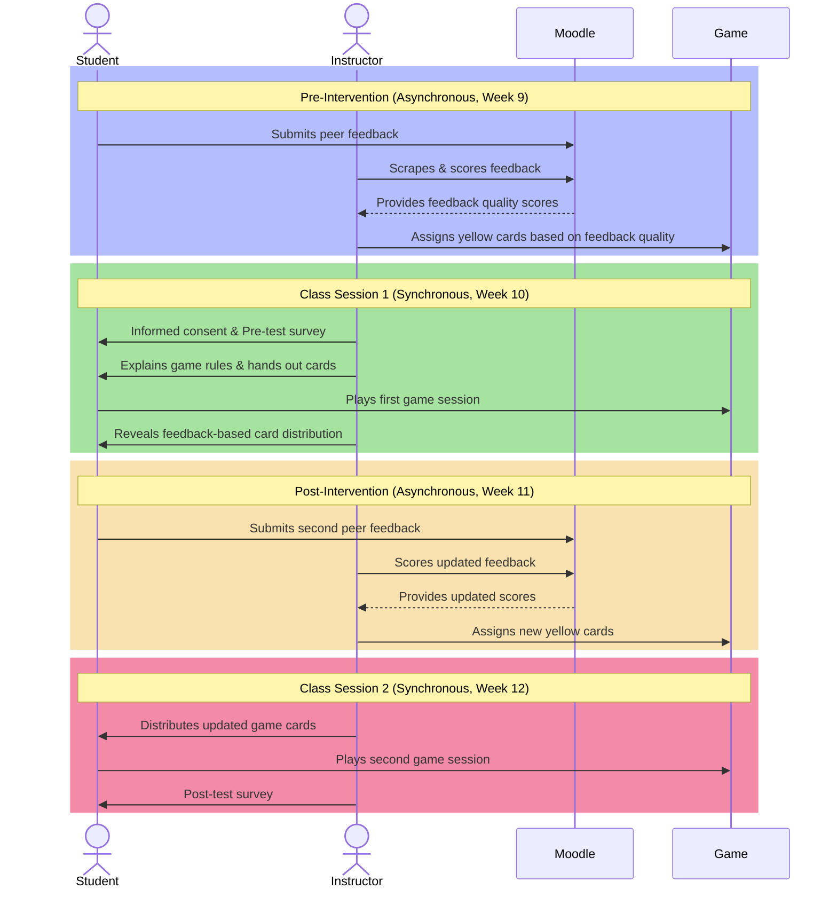

---
{"title":"Thesis","created":"2024-04-27","modified":"2025-03-09","dg-publish":true,"dg-show-toc":true,"permalink":"/50-works/research/thesis/","dgShowToc":true,"dgPassFrontmatter":true,"updated":"2025-03-09"}
---

## ABSTRACT

Peer Code Review (PCR) is a key practice in Computer Science (CS) education, yet students often struggle to provide meaningful feedback. Self-Determination Theory (SDT) highlights the importance of competence, autonomy, and relatedness in sustaining motivation, but traditional peer review methods often fail to support these needs. While gamification has been used to enhance engagement, its reliance on extrinsic rewards may not lead to lasting improvements in feedback quality.

This study explores Game-Based Learning (GBL) as an alternative approach to increasing motivation and feedback quality in CS PCR. Using a pre-post experimental design, students in a Game Programming course ($N = 42$ pre-test, $N = 39$ post-test for motivation; $N = 37$ for feedback quality) participated in peer review before engaging in a card-based game intervention. In-game resources were tied to prior feedback quality, creating a competitive incentive structure. Pre and post-tests measured changes in motivation, while a Wilcoxon Signed-Rank Test assessed feedback improvements.

Results indicate a significant increase in feedback quality ($p = 0.02, N = 37$) and autonomy ($p = 0.01, N = 39$). While perceived competence ($p = 0.08$) and relatedness ($p = 0.12$) also increased, these changes were not statistically significant. These findings contribute to research on GBL in CS education, highlighting its potential to enhance student motivation and learning outcomes in peer review settings.

## LIST OF TABLES

## LIST OF FIGURES

## LIST OF ACRONYMS

- CS: Computer Science
- PCR: Peer Code Review
- GBL: Games-based Learning
- SDT: Self-Determination Theory
- IMI: Intrinsic Motivation Inventory
- CRT: Code Review Taxonomy
- LLM: Large Language Model
- LMS: Learning Management System
- CEGEP: Collège d'enseignement général et professionnel

## INTRODUCTION

Peer Code Review (PCR) is an essential practice in both professional software development and Computer Science (CS) education. By critically evaluating peers’ code, students refine their programming skills, develop critical thinking, and engage in collaborative learning. Despite its importance, research suggests that students often struggle to provide meaningful, actionable feedback, with reviews frequently lacking depth and specificity (Hamer et al., 2009; Indriasari et al., 2020). This limitation reduces the educational value of PCR, making it less effective as a learning tool. One key factor influencing the quality of peer feedback is student motivation. Without sufficient engagement, students may perceive PCR as a routine task rather than an opportunity to improve their coding and evaluation skills (Petersen & Zingaro, 2018).

Motivation is central to student engagement in feedback processes, and Self-Determination Theory (SDT) provides a useful framework for understanding how students interact with learning activities. According to SDT, intrinsic motivation is driven by three fundamental psychological needs: competence, autonomy, and relatedness (Deci & Ryan, 1994). When these needs are met, students are more likely to engage meaningfully with tasks and persist in improving their skills. However, in many traditional peer review settings, these needs may not be adequately supported. Students may not feel competent in their ability to evaluate others’ code, may lack autonomy in the review process, or may not experience a sense of connection with their peers. Addressing these motivational barriers is crucial for ensuring that PCR is not just performed as a requirement but embraced as a valuable learning experience.

One approach that has shown promise in enhancing student engagement is Game-Based Learning (GBL). Unlike gamification, which typically relies on extrinsic motivators such as points and badges, GBL embeds learning objectives within the structure of an actual game, fostering intrinsic motivation through interactivity, competition, and narrative engagement (Papastergiou, 2009). While gamification has been explored as a way to enhance peer review engagement (Indriasari et al., 2023), little research has examined whether a full-fledged game-based approach could improve feedback quality and motivation in PCR. Given the increasing interest in game-based methodologies in CS education, there is a pressing need to investigate how GBL might influence student participation in peer review.

This study explores the impact of a GBL intervention on both the quality of feedback provided during PCR and students’ perceptions of competence, autonomy, and relatedness. A pre-post experimental design was implemented in a Game Programming course at the CEGEP level, where students participated in structured peer feedback activities before engaging in a card-based game intervention. The game’s mechanics were competitive, with students’ in-game resources tied to the quality of their prior feedback. This structure was designed to test whether knowing their feedback influenced their game performance would encourage students to engage more thoughtfully in the peer review process.

Findings from the study indicate a statistically significant increase in feedback quality ($p = 0.02, N = 37$) and perceived autonomy ($p = 0.01, N = 39$). While perceived competence and relatedness also showed positive trends, these increases were not statistically significant. Qualitative responses suggest that the competitive nature of the game heightened engagement, but some students felt it reduced their sense of social connection, raising questions about the trade-offs between competition and collaboration in learning environments.

These results contribute to ongoing discussions about the role of GBL in CS education, demonstrating its potential to enhance student motivation and learning outcomes in peer review settings. The discussion explores how game design elements influenced student behaviour, whether extrinsic incentives can meaningfully shift intrinsic motivation, and the implications for designing future educational interventions. The conclusion reflects on the broader impact of GBL in PCR, its limitations, and recommendations for further research into balancing competition and collaboration in peer learning.

By investigating the relationship between game-based incentives and student engagement, this study offers insights into how CS educators can design more effective peer review experiences. With motivation playing a crucial role in feedback quality, understanding how GBL affects student behavior is essential for improving both the learning process and the long-term development of software engineering skills. The following chapters explore the theoretical foundations of this research, outline the study’s methodology, present the results, and discuss their significance in the broader landscape of CS education.

## CHAPTER 1: PROBLEM STATEMENT

<a class="markdown-embed-link" href="/50-works/research/problem-statement/" aria-label="Open link"><svg xmlns="http://www.w3.org/2000/svg" width="24" height="24" viewBox="0 0 24 24" fill="none" stroke="currentColor" stroke-width="2" stroke-linecap="round" stroke-linejoin="round" class="svg-icon lucide-link"><path d="M10 13a5 5 0 0 0 7.54.54l3-3a5 5 0 0 0-7.07-7.07l-1.72 1.71"></path><path d="M14 11a5 5 0 0 0-7.54-.54l-3 3a5 5 0 0 0 7.07 7.07l1.71-1.71"></path></svg></a>

PCR is a fundamental part of being a professional software developer [@li2006#p. 9]. This is a process that is done when a developer makes a change or add to the already existing codebase. One or more of their teammates will evaluate and make suggestions on the code based on an agreed upon style guide and general coding best practices. These suggestions include, but are not limited to, variable and function naming conventions, spacing, comments, size and scope of functions. The developer then has to implement the feedback from their peers, often creating a dialogue with the team that leads to uncovering more related issues with the codebase. This process is critical in the quality assurance of the application and is commonly enacted by most software companies. Despite this requirement, the research suggests that students lack motivation to give quality peer feedback during the code review process [@indriasari2021a]. To give quality peer feedback, students must be engaged in the process. The literature states that students learn better by doing than by passively listening [@powell2009] and that students can deepen their own learning through peer assessment [@race2001].

However, despite its numerous benefits, one of the challenges encountered in current PCR practices is the low motivation among CS students in providing quality peer feedback. This lack of motivation can hinder the effectiveness of the PCR process and prevent students from fully reaping the benefits of this collaborative learning experience [@petersen2018]. This can be due to various reasons such as time constraints, lack of incentive, or inadequate understanding of the value of constructive feedback. Additionally, students may feel uncomfortable critiquing their peers' work or may not have the necessary skills to provide meaningful and constructive feedback [@perez-quinones2009].

Another challenge is the potential for biases and conflicts to arise during PCR. Students may struggle to separate personal relationships from professional feedback, leading to tension within the peer group. Furthermore, differences in skill levels and experiences among students can also impact the effectiveness of the PCR process, as it may be difficult for students to provide feedback on code that is significantly more advanced or complex than their own [@indriasari2021].

Lastly, the logistics of organizing and managing PCR sessions can also pose challenges. Coordinating schedules, ensuring equal participation, and providing clear guidelines for the review process can be demanding for educators and may impact the overall quality of the review experience [@indriasari2023].

Addressing these challenges is crucial to enhancing the effectiveness of PCR and maximizing its benefits for CS students. Implementing strategies to motivate students, providing training on giving and receiving constructive feedback, and fostering an inclusive and supportive peer review environment are essential steps towards overcoming these obstacles.

## CHAPTER 2: CONCEPTUAL FRAMEWORK

<a class="markdown-embed-link" href="/50-works/research/conceptual-framework/" aria-label="Open link"><svg xmlns="http://www.w3.org/2000/svg" width="24" height="24" viewBox="0 0 24 24" fill="none" stroke="currentColor" stroke-width="2" stroke-linecap="round" stroke-linejoin="round" class="svg-icon lucide-link"><path d="M10 13a5 5 0 0 0 7.54.54l3-3a5 5 0 0 0-7.07-7.07l-1.72 1.71"></path><path d="M14 11a5 5 0 0 0-7.54-.54l-3 3a5 5 0 0 0 7.07 7.07l1.71-1.71"></path></svg></a>

Providing effective code review feedback is a crucial skill for CS students as they prepare to enter the workforce [@sadowski2018]. From my experience as a professional software developer in the industry, I know that PCR is a fundamental skill for programmers. From my experience as a CS student, I know that traditional academic approaches do not always engage or motivate learners especially for the PCR process. On the other end, as a CS teacher, I have seen firsthand how disengaged students can be during PCR sessions. Providing superficial feedback benefits neither the reviewer nor the reviewee. I want to help create a classroom environment where feedback is constructive and where students feel empowered as part of the development process. It is important to create an environment where feedback is constructive and empowers students as part of the development process [@hattie2007]. This is particularly crucial for developing essential skills in professional software developers, such as giving effective feedback during PCR.

This lack of motivation frequently results in surface-level feedback that does little to improve code quality or foster deep learning [@ramsden2003]. This disengagement poses a significant challenge for educators aiming to maximize the effectiveness of PCR practices. The root of this issue may be motivational. SDT provides a potential lens for understanding this phenomenon by highlighting the importance of competence, autonomy, and relatedness for intrinsic motivation [@deci1994]. Traditional PCR processes may fail to adequately support these needs: _competence_, where students may doubt their ability to provide valuable feedback or feel that the focus is solely on error-finding or quality-assurance testing; _autonomy_, where limited choices in how to engage with PCR (code to review, feedback format, etc.) may stifle student ownership; and _relatedness_, where a lack of community focus or a shared sense of purpose can diminish the feeling that PCR is a collaborative improvement process.

GBL offers a promising approach to address these motivational barriers hindering effective PCR. GBL prioritizes immersion, challenge, and (sometimes) social interaction [@papastergiou2009]. These elements have the potential to: _enhance competence_, where well-designed challenges and in-game rewards can build confidence as coding proficiency increases; _foster autonomy_, where GBL systems can offer choices within a structured learning experience, increasing student agency; and _promote relatedness_, where narrative and collaborative gameplay can make PCR feel more purposeful and community-oriented.

As an avid player of both digital and analogue games, I find that my experience in gaming also influences my interest in this topic. In the world of gaming, especially in multiplayer games, communication and teamwork are crucial for success. Similarly, in the area of PCR, effective communication and collaboration are essential for producing high-quality code. Furthermore, the problem-solving and critical thinking skills honed through gaming also translate to the world of programming and code review. The analytical mindset and attention to detail required in gaming parallel the skills needed for thorough code review [@schmitz2011]. Understanding how to engage and motivate students in the context of PCR aligns with the principles of game design, where creating an engaging and immersive experience is paramount. I believe my experience playing games provides me with a unique perspective on the dynamics of PCR and motivates me to delve deeper into this topic.

In this study, I want to examine the quality of PCR feedback and GBL through the lens of student motivation and SDT. Observing the influence of GBL on the quality of feedback provided during PCR will be the key focus of this research. By harnessing the potential of GBL to transform PCR into a more intrinsically motivating, and subsequently, more valuable learning experience, my ultimate goal is to develop GBL interventions that increase student engagement, leading to higher-quality feedback that benefits everyone involved.

## CHAPTER 3: LITERATURE REVIEW

<a class="markdown-embed-link" href="/50-works/research/literature-review/" aria-label="Open link"><svg xmlns="http://www.w3.org/2000/svg" width="24" height="24" viewBox="0 0 24 24" fill="none" stroke="currentColor" stroke-width="2" stroke-linecap="round" stroke-linejoin="round" class="svg-icon lucide-link"><path d="M10 13a5 5 0 0 0 7.54.54l3-3a5 5 0 0 0-7.07-7.07l-1.72 1.71"></path><path d="M14 11a5 5 0 0 0-7.54-.54l-3 3a5 5 0 0 0 7.07 7.07l1.71-1.71"></path></svg></a>

# Literature Review

## The Importance of PCR

PCR is one of the best ways for students to learn programming beyond simply writing their own code. It teaches them how to analyze and critique someone else’s work, which, in turn, makes them better at spotting mistakes in their own. This process is common in professional software development, where developers review and critique each other’s code regularly [@cross1987; @indriasari2020a]. In the classroom, PCR helps students understand coding standards, best practices, and software design principles. But it’s not only about technical skills. Students also practice communicating their ideas, justifying their decisions, and learning from different approaches to the same problem [@indriasari2020a; @petersen2018].

There’s a lot to gain from seeing how someone else thinks through a problem. Students might realize that there’s a simpler way to solve something or that they have been making the same mistake without noticing. Reviewing peer code pushes them to ask, "Why did they do it this way?" and "Would my approach be better?" This kind of critical thinking strengthens problem-solving skills and helps them adapt to new programming concepts [@indriasari2020a; @perez-quinones2009]. It also helps them recognize patterns such as common errors, smart solutions, and efficient techniques they might not have encountered otherwise [@li2006; @petersen2018].

PCR also builds self-awareness, helping students reflect on their own coding habits as they critique their peers’ work. Seeing mistakes or alternative approaches in someone else’s code can prompt students to ask whether they are making similar errors or if they could structure their own code more effectively [@brown2020]. This reflective process reinforces their understanding of key programming concepts, as articulating feedback requires them to evaluate and explain their reasoning clearly [@hamer2009; @hundhausen2013]. Additionally, knowing that their own work will be reviewed by peers makes students more deliberate in their coding decisions, leading to clearer, better-documented programs. Over time, this process fosters accountability and a sense of ownership over their work, preparing them for the expectations of professional software development [@hamer2009; @indriasari2020a].

## The Motivational Challenge

Encouraging CS students to engage meaningfully in PCR presents a challenge. Research indicates that peer reviews often lack depth and specificity, with students providing feedback that is brief, uncritical, or superficial, falling short of instructor expectations [@indriasari2020a; @indriasari2021a]. Many students see peer review as a routine task rather than an opportunity for learning, which limits its potential benefits. While gamification has been shown to increase participation, studies suggest it does not necessarily improve the depth or usefulness of feedback [@khandelwal2017]. This underscores the need for strategies that not only encourage participation but also ensure that students provide thoughtful, constructive feedback. In programming courses, where well-executed peer feedback can significantly enhance learning, motivating students to engage deeply in PCR is especially important.

SDT offers insight into why students may struggle to engage fully in PCR. According to SDT, intrinsic motivation is strongest when three core psychological needs are met: competence, autonomy, and relatedness [@deci1994]. When students feel capable, in control of their learning, and connected to their peers, they are more likely to find PCR valuable and invest effort willingly. Applying SDT to peer review can help identify ways to foster intrinsic motivation, ensuring that students engage not just for external incentives but because they see meaning in the process itself.

_Competence_ refers to the need to feel capable and effective in a task. In PCR, students are more likely to provide meaningful feedback when they feel confident in their ability to understand and evaluate code [@bandura2012]. Those who doubt their programming or review skills may hesitate to offer substantive feedback, leading to shallow assessments. Conversely, students who develop confidence in analyzing code and identifying issues tend to engage more deeply in the review process. Strengthening this sense of competence can be achieved through training, structured review exercises, and guided practice. Research suggests that when students feel prepared and knowledgeable, they are more willing to participate in PCR and contribute meaningfully [@indriasari2020a].

_Autonomy_ is the need to have control and choice in one's actions. In educational settings, students are more intrinsically motivated when they have some say in how they engage with a task. In PCR, autonomy can be supported by allowing students to choose whose code they review or providing flexibility in how they structure their feedback. When students feel trusted to make decisions in the peer review process, they develop a stronger sense of ownership and responsibility [@pintrich2003]. Even small choices, such as selecting which aspects of the code to focus on (style, correctness, efficiency, etc.), can enhance motivation. Prior research indicates that when learners perceive autonomy in academic tasks, their engagement increases [@indriasari2021a].

_Relatedness_ refers to the need to feel connected to others and part of a learning community. PCR fosters relatedness through its collaborative nature, as students engage in reviewing each other’s work, often leading to discussions and shared learning experiences. When the classroom environment promotes trust and cooperation, students are more likely to see peer review as a meaningful, collective effort rather than an isolated requirement. This sense of connection can strengthen motivation, as students recognize that their feedback has value and that they, in turn, benefit from their peers' insights [@powell2009]. A supportive peer review culture, where students feel respected and comfortable giving and receiving feedback, may reinforce relatedness. In contrast, if PCR is conducted in an impersonal or competitive atmosphere, students may disengage to avoid criticism [@indriasari2023].

Addressing these three psychological needs, competence, autonomy, and relatedness, could be key to overcoming motivational barriers in PCR. In practice, this means equipping students with the skills and tools to feel competent in reviewing code through workshops, clear rubrics, and structured practice, supporting autonomy by allowing flexibility in the review process, and fostering relatedness through peer discussions and a collaborative classroom culture. When students feel capable, self-directed, and connected, they are more likely to engage deeply in peer review, producing thoughtful feedback and gaining more from the process [@brown2020]. This SDT perspective frames the exploration of game-based approaches as a potential strategy for improving motivation in PCR.

## Gamification vs. Game-Based Learning

Two pedagogical approaches have gained attention for enhancing student motivation through game elements: gamification and game-based learning (GBL). While both incorporate game concepts into education, they do so in distinct ways. Gamification adds game-like features to a non-game activity, whereas GBL turns the learning process into a game itself [@jayasinghe2013; @al-azawi2016]. In the context of PCR, gamification might involve awarding points or badges for completed reviews, while GBL could transform peer review into an interactive game experience.

In education, gamification typically involves introducing elements such as badges, levels/leaderboards, achievements, and points [@nicholson2015] to make coursework more engaging. The key distinction is that students are not playing a game related to the subject matter; instead, traditional learning tasks like quizzes, assignments, or peer reviews are layered with an external reward system inspired by games [@jayasinghe2013]. This approach primarily drives extrinsic motivation, where students are encouraged to participate in order to earn rewards or avoid penalties rather than out of genuine interest in the task. For example, students may be more inclined to complete peer reviews if doing so earns them points or a higher leaderboard ranking. While gamified peer review systems can lead to an increase in the number of reviews and bug identifications, the quality of comments may not significantly improve, suggesting that extrinsic rewards alone are insufficient for fostering meaningful engagement [@khandelwal2017].

Studies suggest that gamification can positively influence student motivation and participation. In higher education, integrating points and badges into learning activities has been linked to increased student engagement and time spent on tasks [@goshevski2017; @llorens-largo2016; @oktaviati2018]. In CS education specifically, gamification has been associated with higher enthusiasm and persistence. For example, when game elements were added to a peer review system in a programming course, students showed greater willingness to participate in PCR than in a non-gamified setting [@indriasari2023].

Gamifying PCR can take various forms. One approach is to use a dedicated platform that tracks and rewards peer review contributions. Students might earn points for each piece of feedback they provide, unlock badges for reviewing a certain number of peers or identifying critical issues, and see their progress on a class leaderboard [@khandelwal2017]. These systems introduce elements of competition and achievement, making the peer review process more engaging. Researchers have tested these ideas, demonstrating that incorporating challenges and progression levels into PCR increased both the quantity and certain aspects of the quality of student feedback [@indriasari2021a].

While gamification effectively encourages participation, it primarily relies on extrinsic motivation—rewarding specific behaviours to drive engagement. This approach has clear short-term benefits, as students tend to respond positively to rewards and competitive elements. However, a key limitation is that motivation may decline once the rewards are removed or if the novelty fades. This raises the question of whether gamification should be supplemented with or balanced by strategies that foster deeper, intrinsic motivation.

GBL takes a different approach by making a _game_ the central medium for learning. In GBL, students engage with an educational game specifically designed to teach or reinforce key concepts and skills [@al-azawi2016]. Instead of earning points for completing a conventional task, their learning is embedded within a game narrative or challenge. This shifts the motivation from external rewards to the inherent enjoyment, curiosity, and challenge of the game itself, aligning closely with intrinsic motivation. A well-designed educational game keeps students engaged because they want to play, and in the process, they naturally develop the target skills. In PCR, a GBL approach might involve a scenario-based game where students take on roles like "code detective" or "software team leader" and must conduct peer reviews to advance in the story or solve a puzzle. Students who engage with a structured, game-based approach to PCR have been shown to increase knowledge retention and confidence in performing code reviews [@ardic2021]. Here, code review is not a separate assignment but an integral part of an engaging game experience.

Game-based learning has been successfully applied in various areas of computer science education. Educators have developed games to teach programming concepts, algorithms, data structures, and software engineering principles [@schmitz2011; @videnovik2023]. These range from simple quiz-based games to complex simulations and narrative-driven challenges. By interacting with these games, students can explore complex topics in a low-pressure environment. For instance, a game might allow students to visually manipulate algorithms or debug a program in a playful setting, making abstract concepts more concrete. Playing educational games also fosters critical thinking and problem-solving, as students must apply their knowledge to navigate in-game challenges. Additionally, collaboration is often a key element, particularly in multiplayer coding games where students review each other’s code to progress together. This naturally integrates PCR into the gameplay, reinforcing learning through interactive peer engagement. Because GBL packages learning as an enjoyable challenge, students may be more motivated to tackle difficult topics [@papastergiou2009; @goshevski2017].

One major strength of GBL is its ability to bridge theory and practice. Games often simulate real-world scenarios, requiring students to apply theoretical knowledge to achieve success [@chiang2011; @jayasinghe2013]. This makes abstract concepts more tangible and relevant. For example, a game designed to teach secure coding might challenge players to fix vulnerabilities in a series of programs to prevent a simulated cyberattack. In this context, students are not just learning about security concepts but actively applying them in a way that mirrors real-world challenges. Additionally, GBL can leverage storytelling and narrative elements to create immersive learning experiences. A mundane task can be transformed into an engaging adventure, such as a peer review mission where students help a team of stranded programmers debug their code. This type of narrative framing gives purpose to the PCR process within the game world, making it more compelling. When students become invested in the game’s outcome, they are also more engaged in the learning activities required to progress. Unlike gamification, where motivation is often tied to external rewards, GBL fosters deep engagement by making learning an enjoyable and immersive experience [@al-azawi2016; @papastergiou2009].

Research increasingly supports GBL as an effective tool for student engagement. Studies have shown that students learning through games often perform better than those in traditional settings, not necessarily due to differences in content but because game-based environments lead to greater engagement and time-on-task [@lopez-fernandez2021]. Students frequently describe educational games as more enjoyable and can enter a state of flow, where they are fully absorbed in problem-solving and learning. The interactive nature of games, which provides immediate feedback, helps sustain this engagement by allowing students to see the results of their decisions in real time. Additionally, the social dynamics of many games, whether competitive or cooperative, further enhance motivation. Students may compete against one another or collaborate to achieve a shared goal, reinforcing a sense of relatedness that supports deeper learning. Overall, GBL creates an adaptive, dynamic learning environment that provides instant rewards in the form of progress, keeps students engaged through entertainment value, and sustains motivation over time [@videnovik2023]. These qualities make GBL a promising approach for addressing challenges in peer code review.

## The Potential of Game-Based Learning

Computer science education has seen extensive research on gamification, but far less focus on full game-based learning approaches. Studies have examined the impact of game-like elements such as points, badges, and leaderboards on student engagement, with findings suggesting that gamification can lead to short-term increases in participation and modest improvements in learning outcomes when applied effectively [@mohamedmasrop2019]. The literature reveals that while gamification of PCR has been attempted (albeit in only a handful of studies), using an actual game for PCR has received little attention. Ardıç [-@ardic2021] is one of the few studies to explore a game-based approach to teaching code review, though their focus was primarily on introducing students to the process rather than investigating its impact on peer feedback quality.

Peer code review has the potential to be more effective if student motivation can be improved. While the practice itself provides clear benefits for skill development, its success in an educational setting depends on students’ willingness to engage actively. Self-Determination Theory suggests that structuring PCR to support students' feelings of competence, autonomy, and relatedness should foster intrinsic motivation and lead to better outcomes. Traditional methods for increasing PCR participation, such as grading participation or relying on peer pressure, focus on extrinsic motivators and have limited long-term impact.

Gamification has been explored as a way to enhance engagement in PCR. Studies show that adding game elements can increase participation and introduce a level of competition that keeps students involved [@indriasari2020a; @indriasari2023]. However, gamification primarily drives extrinsic motivation, where students may focus on earning points or climbing leaderboards rather than developing high-quality feedback skills. Research has shown that while gamification can lead to more reviews being completed, it does not always improve the depth or usefulness of those reviews [@khandelwal2017]. This raises concerns about whether gamification alone is sufficient for fostering meaningful engagement in PCR or if a more immersive, intrinsically motivating approach like GBL may be necessary.

A GBL approach to PCR could naturally promote deeper engagement by making the peer review process enjoyable in its own right. Unlike gamification, where motivation often stems from external rewards, GBL fosters intrinsic motivation by emphasizing enjoyment, immersion, and challenge. When students are absorbed in a game-based peer review activity, their engagement comes from the experience itself rather than a desire to earn points or climb a leaderboard. This raises the question of whether GBL might be more effective than gamification in cultivating the type of motivation that leads to high-quality feedback.

If students find a code review game genuinely engaging or intellectually stimulating, they are likely to focus on overcoming challenges—such as analyzing and critiquing code—because they want to progress in the game. This could turn PCR from a routine task into a compelling activity, naturally encouraging more thoughtful and thorough feedback. Research suggests that motivation is strongest when students see a task as something they want to do rather than something they have to do for a reward [@khandelwal2017]. This perspective drives the exploration of GBL for PCR: a well-designed educational game may sustain motivation more effectively than a gamified system and lead to higher-quality engagement in peer review.

Despite its strong theoretical potential, the combination of GBL and PCR remains largely unexplored in existing research. Most studies on enhancing peer code review through game elements have focused on gamification, such as adding points and badges or comparing sections with and without gamified incentives. These studies suggest that gamification can be an effective engagement tool, but they also leave open the possibility that a more immersive approach could yield better results. While gamification of PCR has been examined in a limited number of studies, there is no documented research on using a full game-based learning approach for peer code review.

This presents a significant gap in the literature. Although GBL has been shown to improve motivation and learning outcomes in other educational contexts, its impact on PCR has yet to be studied. Given that peer review requires sustained engagement and critical thinking, it stands to reason that an intrinsically motivating approach like GBL could enhance the process. Without empirical research in this area, educators are missing evidence on a potentially transformative method for improving student participation and feedback quality in peer code review.

Recognizing this gap, the present literature review highlights the need for research that applies GBL to PCR in CS education. If future studies demonstrate that embedding peer review within a game environment leads to increased engagement and higher-quality feedback, it could open new possibilities for enhancing learning in programming courses. Such findings could support the development of specialized educational games or platforms that merge the pedagogical benefits of PCR with the motivational impact of games.

Exploring GBL in PCR aligns with the broader goal of fostering intrinsic motivation in learners. If GBL proves to be more effective than traditional methods or simple gamification, it could significantly enhance the effectiveness of PCR as a learning tool. This study aims to address this gap by investigating whether a game-based learning strategy can improve both student motivation and the quality of peer feedback in a CS course. By doing so, we seek to contribute empirical evidence on whether GBL provides a meaningful advantage over gamification in engaging students in high-quality peer code review.

## CHAPTER 4: METHODOLOGY

<a class="markdown-embed-link" href="/50-works/research/methodology/" aria-label="Open link"><svg xmlns="http://www.w3.org/2000/svg" width="24" height="24" viewBox="0 0 24 24" fill="none" stroke="currentColor" stroke-width="2" stroke-linecap="round" stroke-linejoin="round" class="svg-icon lucide-link"><path d="M10 13a5 5 0 0 0 7.54.54l3-3a5 5 0 0 0-7.07-7.07l-1.72 1.71"></path><path d="M14 11a5 5 0 0 0-7.54-.54l-3 3a5 5 0 0 0 7.07 7.07l1.71-1.71"></path></svg></a>

This study is grounded in existing literature on PCR, the application of motivational theories, specifically SDT, and the use of GBL in CS education. It contributes to the field by exploring a novel approach to a persistent challenge in CS education: how to cultivate the student motivation essential for effective PCR and the development of crucial software development skills. Specifically, this study seeks to determine whether a game-based learning intervention increases the quality of feedback provided during CS PCR and whether it influences students' perceived competence, autonomy, and relatedness, as conceptualized by SDT.

## Research Design

This study employed a mixed-methods pre-post experimental design to investigate the impact of a GBL intervention on both the quality of feedback provided during CS PCR and students' self-reported motivation in alignment with SDT. The target population consisted of third-year CS students at the CEGEP level in Quebec, selected due to their advanced programming experience and the critical role of PCR in preparing them for collaborative software development practices. The study was conducted within two sections of a Game Programming course in the CS program at John Abbott College, with a sample size of 42 students in the pre-test and 39 students in the post-test for motivation analysis, and 37 students for the analysis of feedback quality. Data collection took place during Week 10 (pre-test) and Week 12 (post-test) of the Fall 2024 semester, allowing for an assessment of changes in student motivation and feedback quality over time. A pre-test/post-test approach was used to assess changes over time within the same group of students rather than comparing two separate groups.

## Procedure

The sequence of activities in this study is visually represented in Figure 1, which distinguishes between asynchronous and synchronous phases of the intervention.

**Figure 1**

*Intervention Sequence Diagram*

### Pre-Intervention Phase

Prior to this study, students had been engaging in peer feedback activities since the early weeks of the semester, using the Peer Code Review Rubric (Appendix A) as a reference for evaluating their peers' work. This rubric provided a structured framework that guided their feedback, ensuring consistency and clarity in their evaluations. These prior experiences with peer review helped establish a baseline understanding of feedback expectations before the intervention was introduced.

Prior to the intervention, students participated in asynchronous peer feedback through Moodle's Workshop activity [@moodle2024]. Each student provided feedback on their peers’ work, and this feedback was extracted using a custom scraper (Appendix E) developed by the researcher. The extracted feedback was anonymized and analyzed using a Large Language Model (LLM) [@openai2024], which categorized comments based on a Code Review Taxonomy (Appendix B). The taxonomy classifies feedback into distinct categories that reflect specificity and constructiveness, such as "SA" (Strong Actionable), "G+" (General Positive), or "G0" (General Neutral). To quantify the quality of feedback for analysis, each taxonomy category was assigned a numerical score using a predefined conversion system (Table 1). These scores were then used to determine the number of yellow action cards received at the start of the game, introducing a performance-based starting condition for the intervention.

**Table 1**

*Numerical Conversion of Feedback Quality Scores*

|Code|Description|Score|
|---|---|---|
|SA|Strong Actionable|5|
|S+/S-|Specific Positive/Negative|4|
|S0|Specific Neutral|3|
|G+/G-/GA|General Positive/Negative/Advice|2|
|G0/PV|General Neutral/Placeholder Value|1|
|OT|Off-topic/Irrelevant|0|

To ensure that the game could be reasonably completed within a class session, a simulation was developed (Appendix F) to play 1000 rounds of the game under varying conditions. The results indicated that the average game lasted 13 turns, with the longest game reaching 24 turns. In terms of duration, the simulation estimated an average game time of 19 minutes, with the longest recorded game taking 35 minutes. These findings informed the design choices, such as the number of starting resources and the inclusion of time-limiting mechanics to maintain feasibility within the allotted class period.

Each student provided feedback on three peers, and the median of these three numerical scores was used as their individual feedback quality score in statistical analysis.

### Intervention Phase

During a synchronous class session, students first completed the informed consent form and the pre-test, which measured perceived competence, autonomy, and relatedness. They were then placed into groups of four and received physical card decks for gameplay. The instructor displayed a table assigning yellow cards to each student, prompting curiosity about the distribution.

Students played the game (Appendix G) under standard conditions, engaging with mechanics centred around resource management, strategy, and competition. Since this was a Game Programming course, the entities within the game were all based on fundamental game development concepts. Students aimed to build four key structures (State Machine, Sprite, Timer, and Collision) by collecting and trading resource cards while managing setbacks introduced by special action cards. While the game itself did not directly involve peer feedback, its competitive structure introduced an incentive-based framework that was later linked to students' feedback quality in the debriefing session. After gameplay, it was revealed that the initial yellow card distribution was based on their previous peer feedback quality, emphasizing the relationship between quality feedback and game resources.

### Post-Intervention Phase

Following the first game session, students completed another asynchronous peer feedback activity through Moodle, knowing that their feedback quality would impact their performance in a future game session. The second iteration of the game followed the same structure as the first, with students receiving yellow cards based on their new feedback quality scores. After playing the game for the second time, students completed the post-test survey, measuring changes in their perceptions of competence, autonomy, and relatedness.

## Instruments

### Intrinsic Motivation Inventory

The Intrinsic Motivation Inventory is a validated Likert-style survey that measures student motivation in PCR, assessing sub-scales for competence, autonomy, relatedness, and enjoyment [@ryan1983]. It utilizes a 5-point scale (1 = _not at all true_ to 5 = _very true_). Survey questions were adapted to reflect the PCR experience. For example, competence-related questions included statements such as, _"I think I am pretty good at peer code review."_ and _"I am satisfied with my ability to assess my peers’ code."_ Autonomy-related items asked students whether they felt they had choices in how they provided peer feedback or whether they had input in deciding how to evaluate their peers’ work. Relatedness was assessed through questions that explored whether students felt connected to their peers during the peer review process and whether they felt comfortable giving feedback. Enjoyment-focused questions measured whether students found the peer review process enjoyable and whether they had fun participating. The full list of pre-test and post-test survey questions is included in Appendix D to provide a comprehensive view of the assessment instrument.

### Code Review Taxonomy

A Code Review Taxonomy (Hamer et al., 2015; Indriasari et al., 2023) categorized feedback comments into distinct types. Feedback was classified as either positive or negative, depending on whether it reinforced correct implementation or identified issues. Additionally, comments were categorized based on whether they provided actionable advice or suggestions for improvement. The taxonomy also distinguished between general feedback, which addressed broader coding concepts, and code-specific feedback, which focused on particular lines of code or implementation details. These categories provided a structured framework for analyzing feedback quality.

## Data Analysis

Data analysis focused on assessing changes between pre and post-test measures, as well as evaluating improvements in peer feedback quality. The Wilcoxon Signed-Rank Test was applied to analyze pre-post differences in feedback quality scores. Each student provided feedback to three peers in both the pre and post-intervention phases. The median feedback quality score from each student's three evaluations was used for the Wilcoxon analysis to account for variability across different peer reviews. To assess changes in perceived competence, autonomy, and relatedness, paired t-tests were conducted on the mean scores of the questions corresponding to each respective SDT motivation sub-scale. Additionally, descriptive statistics such as mean and median scores were calculated for each variable to provide a clearer picture of the trends in student motivation and feedback quality over time.

## Ethical Considerations

The researcher’s dual role as instructor and researcher introduced potential concerns regarding coercion. To mitigate this, explicit informed consent was obtained (Appendix C), and students were informed that participation was voluntary, with the option to withdraw at any time without consequences. Prior to participation, students received a full explanation of the study’s objectives, procedures, and potential risks and benefits, ensuring informed decision-making.

Pre-test and post-test survey responses were anonymous, ensuring that students’ self-reported motivation data remained confidential. However, peer feedback quality data was not anonymized, as tracking individual performance was necessary for assigning starting resources in the game-based intervention. To protect student privacy, only the researcher had access to identifiable data, and all reports of findings used anonymized data. Students were explicitly informed that their grades would not be affected by their participation. The study adhered to institutional ethical guidelines, and all collected data was stored securely on Canadian servers using the Moodle LMS and Microsoft Forms.

## CHAPTER 5: RESULTS

<a class="markdown-embed-link" href="/50-works/research/results/" aria-label="Open link"><svg xmlns="http://www.w3.org/2000/svg" width="24" height="24" viewBox="0 0 24 24" fill="none" stroke="currentColor" stroke-width="2" stroke-linecap="round" stroke-linejoin="round" class="svg-icon lucide-link"><path d="M10 13a5 5 0 0 0 7.54.54l3-3a5 5 0 0 0-7.07-7.07l-1.72 1.71"></path><path d="M14 11a5 5 0 0 0-7.54-.54l-3 3a5 5 0 0 0 7.07 7.07l1.71-1.71"></path></svg></a>

## Pre-Test Findings

Before evaluating the impact of the game-based learning intervention, a pre-test was conducted to assess participants' gaming preferences, prior exposure to game-based learning, and familiarity with card-based mechanics. The majority of students reported a strong preference for games, with a mean of 4.64 (on a 5-point scale) for the statement "I enjoy playing games (analogue or digital)." Nearly all participants (93%, $N=42$) enjoyed playing video games, with 74% playing at least once a week. Board games (67%) and card games (62%) were also popular.

Despite this enthusiasm for gaming, prior exposure to game-based learning in academic settings was limited. Only 5% of participants reported frequent exposure, while 57% had rarely engaged in such learning activities, and 42% had never participated in game-based learning. Given that the intervention used a card-based peer feedback game, familiarity with card games was also assessed, with 95% of students indicating at least some familiarity.

When it came to gameplay preferences, 64% of students preferred playing with others, 26% had no preference, and only 10% preferred playing alone. Competitive games were slightly more popular, with 52% favouring them, while 28% had no preference, and 20% preferred cooperative experiences.

## Peer Feedback Quality

Descriptive statistics for feedback quality scores ($N=37$) are presented in Table 2. Each student provided three separate peer feedback scores which were analyzed using a Code Review Taxonomy (Appendix B) and assigned a numerical score based on predefined criteria (see Table 1 in Methodology). These scores ranged from 0 (off-topic/irrelevant feedback) to 5 (strong actionable feedback).

**Table 2**

_Descriptive Statistics for Feedback Quality_

|                    | Pre-Test | Post-Test |
| ------------------ |:------: |:-------: |
| Mean               |   2.95   |   3.84    |
| Median             |    3     |     4     |
| Mode               |    2     |     4     |
| Standard Deviation |   1.25   |   1.14    |

The median feedback quality score was 2.95 (pre) and 3.84 (post), indicating an upward shift in feedback ratings.

A visual representation of the distribution of pre and post-intervention feedback quality scores is shown in Figure X. As depicted in the box plot, post-test feedback scores demonstrated an increase in median values.

**Figure 2**

_Pre and Post-Intervention Peer Feedback Scores_

A Wilcoxon signed-rank test was conducted to assess whether the median feedback quality scores significantly increased after the intervention. The results indicated that post-intervention feedback scores ($Mdn=4.0$) were significantly higher than pre-intervention scores ($Mdn=3.0$), $z=-3.09, p<.05$.

## Motivation Sub-Scales

Descriptive statistics for feedback quality scores are presented in Table 3.

**Table 3**

_Descriptive Statistics for Motivation Scores_

|           | Autonomy Pre | Autonomy Post | Competence Pre | Competence Post | Relatedness Pre | Relatedness Post |
| --------- |:----------: |:-----------: |:------------: |:-------------: |:-------------: |:--------------: |
| Mean (SD) | 3.39 (0.72)  |  3.78 (0.69)  |  3.52 (0.76)   |   3.61 (0.76)   |   3.29 (0.86)   |   3.67 (0.93)    |
| Median    |     3.67     |     3.67      |      3.50      |      3.67       |      3.50       |       4.00       |
| Mode      |     3.67     |     3.33      |      3.33      |      3.67       |      3.50       |       4.00       |

Mean scores for autonomy, competence, and relatedness increased from pre-test to post-test, though the extent of these changes varied.

Figure 3 presents box plots comparing pre and post-test scores for autonomy, competence, and relatedness.

**Figure 3**

_Pre and Post-Test Scores for Autonomy, Competence, and Relatedness_

The distributions indicate that while autonomy showed a noticeable increase, changes in competence and relatedness were less pronounced.

A series of independent t-tests, as seen in Table X, were conducted to examine differences in perceived autonomy, competence, and relatedness before and after the game-based learning intervention.

**Table 4**

_Independent T-Test Results for SDT Sub-Scales_

| Sub-Scale   | Pre-Test Mean (SD) | Post-Test Mean (SD) | t(79) | p (two-tail) |
| ----------- |:----------------: |:-----------------: |:---: |:----------: |
| Autonomy    |    3.39 (0.72)     |     3.78 (0.69)     | -2.46 |    0.016     |
| Competence  |    3.52 (0.76)     |     3.61 (0.76)     | -0.54 |    0.592     |
| Relatedness |    3.29 (0.86)     |     3.67 (0.93)     | -1.92 |    0.058     |

The results indicate a statistically significant increase in autonomy at the $α=0.05$ threshold, with post-test scores ($M=3.78, SD=0.69$) being significantly higher than pre-test scores ($M=3.39, SD=0.72$), $t(79)=-2.46, p=.016$, suggesting that the intervention positively influenced students' sense of autonomy. However, no significant differences were found in competence, where post-test scores ($M=3.61, SD=0.76$) did not significantly differ from pre-test scores ($M=3.52, SD=0.76$), $t(79)=-0.54, p=.592$. Similarly, relatedness showed a marginal increase, but the difference did not reach statistical significance, with post-test scores ($M=3.67, SD=0.93$) compared to pre-test scores ($M=3.29, SD=0.86$), $t(79)=-1.92, p=.058$. These findings suggest that while the intervention had a measurable effect on students' perceived autonomy, its impact on competence and relatedness was not statistically significant.

## Post-Test Findings

As a secondary measure of the intervention's effectiveness, students were asked to rate their enjoyment of the peer feedback card game. The results indicate a high level of engagement, with a mean of 4.79 (on a 5-point scale) and a median and mode of 5, suggesting that most students strongly agreed that they enjoyed playing the game.

Students also provided open-ended responses to the following question: _"Did participating in the card game influence your approach to giving or receiving peer feedback? Please describe any specific ways the game affected your motivation, engagement, or quality of feedback, or if it had no impact."_ A thematic analysis revealed four primary themes: increased motivation due to game mechanics, no significant change in feedback approach, awareness of feedback impact but not strong motivation, and perceived pressure or lack of understanding. The distribution of responses is summarized in Table 5.

**Table 5**

_Thematic Breakdown of Student Feedback_

| Theme                                                   | Number of Responses (N=39) |
| ------------------------------------------------------- |:------------------------: |
| Increased motivation due to game mechanics              |             21             |
| No significant change in feedback approach              |             8              |
| Awareness of feedback impact but not strongly motivated |             6              |
| Perceived pressure or lack of understanding             |             4              |

Over half of the students (54%) reported that the game-based intervention increased their motivation to provide better feedback. Many described the incentive structure as a driving force behind their engagement, with one student stating, _"100%, before I only put 'good job' or 'error in x.js,' but now I went in-depth knowing it would give me an edge while playing the game."_ Another noted, _"It simply motivated me to look at their code further and give more insightful feedback."_ Many students noted increased motivation, as evidenced by their detailed responses.

Despite this, 21% of students reported that the game had no meaningful effect on their approach to peer feedback. Some explained that they were already motivated to provide detailed responses and did not feel the game altered their process. One student reflected, _"Not necessarily. My approach for giving peer feedback is being as fair as possible, and I don't let the thought of it affecting the card game sway my decisions."_

For 15% of students, the game increased their awareness of feedback quality without fully changing their habits. One student shared, _"Knowing that you get more yellow cards definitely prompted me to give more in-depth peer feedback,"_ while another mentioned, _"I wouldn't go out of my way to provide feedback, but if it was an easy bug fix that I could provide, I would give them the feedback on it."_

A smaller group (10%) reported feeling pressured or confused about how the game tied into their feedback quality. One student expressed concern that _"After the card game, I felt that the bar for effort in grading was set from our previous results. It put pressure to either match how we graded previously or improve while discouraging doing any less than that."_ Another noted, _"Today was the first day that I played the card game, and honestly, I had no idea how it worked, so I never thought of the card game when I was grading before."_

These qualitative insights highlighted the varying degrees to which students internalized the intervention. Student responses varied, with some expressing strong motivation, others showing minimal change, and a few feeling pressure or confusion.

## CHAPTER 6: DISCUSSION

<a class="markdown-embed-link" href="/50-works/research/discussion/" aria-label="Open link"><svg xmlns="http://www.w3.org/2000/svg" width="24" height="24" viewBox="0 0 24 24" fill="none" stroke="currentColor" stroke-width="2" stroke-linecap="round" stroke-linejoin="round" class="svg-icon lucide-link"><path d="M10 13a5 5 0 0 0 7.54.54l3-3a5 5 0 0 0-7.07-7.07l-1.72 1.71"></path><path d="M14 11a5 5 0 0 0-7.54-.54l-3 3a5 5 0 0 0 7.07 7.07l1.71-1.71"></path></svg></a>

This study investigated whether a GBL intervention could improve the quality of peer feedback provided during PCR and enhance students' perceptions of autonomy, competence, and relatedness, as conceptualized by SDT. The results indicate a statistically significant improvement in feedback quality ($W=42.0$, $z=-3.09$, $p=.002$) and autonomy ($t=-2.46$, $p=.016$), alongside high levels of enjoyment for the peer feedback card game ($M=4.79$, $Mdn=5.0$). However, competence ($t=-0.54$, $p=.592$) and relatedness ($t=-1.92$, $p=.058$) did not show statistically significant improvements. Qualitative responses provided further insights into how students perceived the game's influence on their motivation and engagement with the peer feedback process.

## Interpretation Through the Lens of SDT

### Autonomy

The increase in autonomy suggested that the game created a more engaging and self-directed review process. However, this result should be interpreted with caution due to potential response bias in survey wording. The pre-test question (*"I feel in control of the peer feedback I provide"*) and the post-test question (*"The card game made me feel more in control of the peer feedback I gave"*) differed in phrasing, explicitly introducing the game in the latter. This may have influenced how students interpreted "control", either as greater decision-making flexibility or as external structuring imposed by the game.

Despite these concerns, SDT suggests that autonomy is enhanced when individuals feel their actions are self-directed and meaningful [@deci1994]. The game allowed students to make strategic choices about their feedback and engage in a self-paced review process, which likely contributed to the observed increase in autonomy. Prior research has shown that game mechanics that promote player agency can enhance intrinsic motivation in learning environments [@indriasari2023; @papastergiou2009]. Future iterations of the intervention should refine survey wording and explore additional mechanisms for reinforcing student autonomy.

### Competence

Although feedback quality improved significantly, students did not report a corresponding increase in perceived competence. One possible explanation is that their self-perception did not align with actual improvements in their feedback. While the game encouraged more detailed peer reviews, students may not have felt that their evaluation skills had meaningfully improved. Research suggests that competence is best supported when learners receive clear performance indicators and structured guidance [@bandura2012; @hattie2007].

Some students indicated that while they engaged more deeply in peer feedback, they did not necessarily feel more skilled. One student reflected, *"Yes, the card game influenced me to give more feedback but up to a certain degree. I wouldn't go too out of my way, but if it was an easy bug fix that I could provide, I would give them the feedback on it."* This suggests that while the game motivated participation, it may not have fully supported skill development in a way that led to a stronger sense of competence.

To better support competence, future iterations could incorporate scaffolding mechanisms such as detailed rubrics, worked examples, or formative feedback sessions. Direct comparisons between students' feedback before and after the game could also help them see tangible improvements, reinforcing their sense of competence.

### Relatedness

While relatedness did not show a statistically significant improvement, qualitative responses revealed mixed experiences. Some students found the game engaging and social, while others did not see a strong connection between the game and peer interactions. The competitive nature of the game may have contributed to this, as competition can sometimes emphasize individual performance over collaboration. Pre-test data showed that 52% of students preferred competitive games, 20% preferred cooperative games, and 28% had no preference. While the competitive format aligned with some students' preferences, it may have been less engaging for those who favour collaborative experiences.

Pre-test data further supports this distinction, showing that while most students (64%) preferred playing games with others, 26% had no preference, and only 10% preferred playing alone. Additionally, students' familiarity with gaming may have influenced engagement as most students (93%) reported enjoying video games, and 62% specifically enjoyed card games. However, two students had no familiarity with card games, which may have impacted their ability to fully engage with the mechanics of the intervention.

One student noted, *"The game made me a bit competitive, which affected the way I gave feedback to have a better chance of winning the card game."* Others, however, felt neutral or pressured, with one stating, *"After the card game, I felt that the bar for effort in grading was set from our previous results. It put pressure to either match how we graded previously or improve, while discouraging doing any less than that."* These mixed responses highlight the need to balance competition and cooperation in future iterations of the intervention.

To foster greater social connection, future iterations could introduce hybrid game mechanics, such as team-based challenges or cooperative feedback activities. This aligns with prior research suggesting that relatedness in peer review depends on how collaborative interactions are designed [@powell2009].

## Game-Based Learning in Peer Code Review

The positive impact of the intervention on feedback quality and student engagement supports the potential of GBL as an effective approach for improving PCR in CS education. This aligns with research comparing gamification and GBL, which suggests that while gamification often relies on extrinsic motivators, GBL fosters intrinsic engagement by embedding learning within game mechanics [@jayasinghe2013; @goshevski2017]. Unlike gamification, which applies external rewards to an existing task, GBL integrates the learning process into the mechanics of the game itself, making engagement more sustained and meaningful.

Student reflections reinforced this connection between game mechanics and engagement. One student noted, *"100%, before I only put ‘good job' or ‘error in x.js' but now I went in-depth knowing it would give me an edge while playing the game."* Another remarked, *"It gave me an incentive to put more effort and details into my peer feedback than before."* These responses align with research on gamification, which suggests that competitive mechanics can encourage greater engagement in peer assessment [@indriasari2023]. Prior studies have demonstrated that incorporating points, leaderboards, and competitive elements can increase motivation in peer review [@indriasari2020a; @indriasari2021a], but this study builds on those findings by demonstrating that a fully game-based approach can lead to significant improvements in feedback quality [@ardic2021].

## Limitations and Future Directions

Although the study demonstrated statistically significant improvements in feedback quality and autonomy, several limitations must be considered. The study was conducted within a single Game Programming course with a limited sample size ($N=42$ pre-test, $N=39$ post-test for motivation analysis, $N=37$ for feedback quality analysis). While the findings suggest that game-based learning can enhance peer feedback quality and autonomy, they may not generalize to different institutional settings, CS subfields, or students with varying levels of programming experience. Future research should investigate whether similar outcomes are observed in larger, more diverse student populations, including students in introductory programming courses and those at different stages of their academic careers.

The researcher and instructor being the same person may have influenced student engagement. While steps were taken to anonymize scoring and ensure voluntary participation, it remains possible that students’ awareness of the study influenced their motivation. Future studies could explore whether similar results occur when a different instructor facilitates the intervention to reduce potential bias.

The novelty effect may have also played a role in student engagement. Pre-test data indicated that most students had limited prior experience with game-based learning, with 57% having rarely participated in it and 24% never having done so. Prior research suggests that novelty can temporarily increase motivation [@papastergiou2009], meaning that enthusiasm may have been partially driven by the newness of the approach. A longitudinal study or multiple gameplay sessions could assess whether engagement persists beyond the initial exposure.

The lack of significant changes in competence and relatedness suggests areas for refinement in game design. Student feedback on game mechanics revealed that while the competitive elements were engaging, some players found that the distribution of power-ups and the lack of collaborative mechanics limited their experience. One student suggested, *“There should be some lore to the game, like why are we collecting all the green cards, what are we building, who are we destroying?”* while another noted that *“the trade is almost not used”* and suggested improvements to make certain game mechanics more meaningful. The results indicate that future iterations could benefit from explicit scaffolding, structured rubrics, and guided reflection exercises [@ardic2021] to reinforce competence, while also introducing collaborative mechanics such as peer mentoring or cooperative challenges to strengthen social connections. Expanding the game to include more power-up cards, adjusting the distribution of yellow cards, or refining game balance may also improve long-term engagement.

Further research should explore how game-based peer feedback systems can be improved beyond a single intervention. By iterating on game mechanics, testing different rule modifications, and embedding feedback training directly into gameplay, future studies can refine the role of game-based learning in sustained motivation and long-term feedback improvement.

## CHAPTER 7: CONCLUSION

In this chapter you state the answers to your research questions based on the observations and data accumulated and reported in the data chapter. One approach is to write the final paragraph first as a summary of what you would like the reader to take away. Then provide a concluding statement for each question. There should be statements of the limitations of these conclusions, implications for further research, and implications for your future teaching practice.

The conclusion summarizes the key findings, emphasizes their significance, and suggests future research directions.

- **Example:**
    "This study demonstrates that remote work can enhance productivity, but organizations must address communication barriers to maximize its benefits. Future research should focus on sector-specific impacts of remote work."

## Appendix A: PCR RUBRIC

==Replace with clean code rubric==

## Appendix B: CODE REVIEW TAXONOMY

<a class="markdown-embed-link" href="/50-works/research/code-review-taxonomy/" aria-label="Open link"><svg xmlns="http://www.w3.org/2000/svg" width="24" height="24" viewBox="0 0 24 24" fill="none" stroke="currentColor" stroke-width="2" stroke-linecap="round" stroke-linejoin="round" class="svg-icon lucide-link"><path d="M10 13a5 5 0 0 0 7.54.54l3-3a5 5 0 0 0-7.07-7.07l-1.72 1.71"></path><path d="M14 11a5 5 0 0 0-7.54-.54l-3 3a5 5 0 0 0 7.07 7.07l1.71-1.71"></path></svg></a>

# Code Review Taxonomy

- **S+**: Comments in this category provided positive feedback about a specific element of the code.
- **S−**: Comments in this category provided specific negative feedback about the functionality, style or correctness of the program.
- **S0**: Comments in this category were specific, but were not obviously positive or negative in tone.
- **SA**: Comments in this category provided specific advice to a student about how to improve their code.
- **G+**: Comments in this category are general comments that are positive. The comments do not relate to a specific element of style or requirement specified in the assignment.
- **G−**: Comments in this category are general negative comments. They do not refer to any specific elements of code, but are instead comments directed at the overall quality (summary comments).
- **G0**: Comments in this category are general comments that do not have either positive or negative connotations.
- **GA**: Comments in this category provided general advice to peers, but did not refer to specifics within the code.
- **PV**: Comments in this category were personal in tone in that they recognised that the comments, although being about a submission, were directed to another person. Many of these were combined with one of the other categories, linked with a general or specific criticism.
- **OT**: Comments in this category were off-topic.

## Appendix C: CONSENT FORM

<a class="markdown-embed-link" href="/50-works/research/consent-form/" aria-label="Open link"><svg xmlns="http://www.w3.org/2000/svg" width="24" height="24" viewBox="0 0 24 24" fill="none" stroke="currentColor" stroke-width="2" stroke-linecap="round" stroke-linejoin="round" class="svg-icon lucide-link"><path d="M10 13a5 5 0 0 0 7.54.54l3-3a5 5 0 0 0-7.07-7.07l-1.72 1.71"></path><path d="M14 11a5 5 0 0 0-7.54-.54l-3 3a5 5 0 0 0 7.07 7.07l1.71-1.71"></path></svg></a>

## Purpose

This project is being conducted by Vikram Singh, a Computer Science Teacher at John Abbott College, for the completion of a Master's Degree in College Teaching, accredited by the Université de Sherbrooke. This study explores how different approaches to peer code review affect student motivation and feedback quality.

## Procedure

1. Before beginning the activity, you'll complete a short survey regarding your perspectives on peer feedback.
2. You will participate in a brief card game related to your course material.
3. After the card game, you'll complete a survey about your experience.
4. Your feedback on the course assignments, along with survey responses, will be analyzed to better understand factors influencing feedback quality and student motivation in peer code review.

## Potential Risks & Benefits

There are no known risks for participation in this study.

By investigating what makes peer code review motivating (or not), your participation could lead to the design of interventions that make peer code review a more engaging and beneficial process for everyone. Your participation could help students develop stronger feedback skills, crucial for both their success in CS courses and future careers. The findings could provide valuable information to your instructor and others about how to refine peer code review practices, potentially leading to widespread changes that enhance the learning experience for many CS students. For your interest, the results of the study will be sent to you after the study has been completed, if so desired.

## Confidentiality

Your participation in this study is confidential in the following ways:

1. Your name will not appear in the research results.
2. The researcher/teacher will never know if you agree or do not agree to participate in this study, therefore the choice to participate or not has no impact on your final grade, nor on any future interaction with your teacher.
3. The survey results will be anonymous and kept for five years in Microsoft OneDrive behind two-factor authentication.
4. The Microsoft Forms questionnaire will be completed anonymously and your personal information will not be revealed. The servers for Microsoft Forms and OneDrive are stored in Canada and therefore your data is protected by Canadian laws.

Your participation in this research is completely voluntary. You have the right to not consent or withdraw consent at any time. If you have any questions about the content or methods of this study, please feel free to contact the teacher/researcher, Vikram Singh, at [vikram.singh@johnabbott.qc.ca](mailto:vikram.singh@johnabbott.qc.ca) or the supervisor, Paul Darvasi, at [paul.darvasi@usherbrooke.ca](mailto:paul.darvasi@usherbrooke.ca).

If you have any questions about your rights or treatment during this study, please contact the Research and Innovation Officer at JAC, Teresa Hackett, at [teresa.hackett@johnabbott.qc.ca](mailto:teresa.hackett@johnabbott.qc.ca).

## Statement of Consent

I attest that I have read the above information and freely consent to participate in the study on peer code review within the context of my 420-5P6 Game Programming course during the Fall 2024 semester at John Abbott College. I understand that my peer feedback data from the course assignments, which may include identifiable information, will be used to facilitate the card game activity and subsequent analysis. I also acknowledge that while this data may be referenced during the activity, my name or any other personal identifiers will not appear in the final research report.

- Student Name
- Student ID
- Date

I wish to receive the results of the study. My email is:

## Appendix D: PRE & POST SURVEYS

<a class="markdown-embed-link" href="/50-works/research/pre-test-and-post-test/" aria-label="Open link"><svg xmlns="http://www.w3.org/2000/svg" width="24" height="24" viewBox="0 0 24 24" fill="none" stroke="currentColor" stroke-width="2" stroke-linecap="round" stroke-linejoin="round" class="svg-icon lucide-link"><path d="M10 13a5 5 0 0 0 7.54.54l3-3a5 5 0 0 0-7.07-7.07l-1.72 1.71"></path><path d="M14 11a5 5 0 0 0-7.54-.54l-3 3a5 5 0 0 0 7.07 7.07l1.71-1.71"></path></svg></a>

1. What types of games do you enjoy playing? (Check all that apply)
	- Board games
	- Card games
	- Video games (console or PC)
	- Mobile games
	- Role-playing games (ex. Dungeons & Dragons)
	- Puzzles
	- Sports
2. How often do you play games?
	- Always (everyday)
	- Frequently (a fe times a week)
	- Occasionally (a few times a month)
	- Rarely (a few times a year)
	- Never
3. What do you enjoy most about playing games? (Check all that apply)
	- Strategic Thinking
	- Social Interaction
	- Problem-Solving
	- Competition
	- Relaxation/Fun
	- Achieving Goals
4. Have you ever participated in learning activities through games in other courses?
	- Never
	- Rarely (once or twice per semester)
	- Occasionally (every few weeks)
	- Frequently (weekly or more often)
5. How familiar are you with card games specifically?
	- Not at all familiar
	- Somewhat familiar
	- Very familiar
6. Do you prefer playing games alone or with others?
	- Alone
	- With others
	- No preference
7. Do you prefer competitive or cooperative games?
	- Competitive (I enjoy games where I compete against others)
	- Cooperative (I enjoy games where I work with others toward a common goal)
	- No preference

| Aspect                           | Pre-Test                                                              | Post-Test                                                                                     | SDT         |
|----------------------------------|-----------------------------------------------------------------------|-----------------------------------------------------------------------------------------------|-------------|
| Gaming Perception                | I enjoy playing games (analogue or digital).                          | I enjoyed playing the card game.                                                              | Enjoyment   |
| Enjoyment of Feedback            | I enjoy providing feedback to my peers.                               | I enjoyed providing feedback to my peers more knowing how it affects the card game.           | Enjoyment   |
| Effort in Giving Feedback        | I usually put a lot of effort into the feedback I give.               | I put more effort into giving peer feedback knowing how it affects the card game.             | Effort      |
| Helpfulness of Feedback Given    | I believe the feedback I give is helpful in improving my peers' work. | I believe the feedback I give is helpful in improving my peers' work.                         | Usefulness  |
| Helpfulness of Feedback Received | I believe the peer feedback I receive is useful for improving my work.| The feedback I received was helpful in improving my work.                                     | Usefulness  |
| Perceived Competence in Feedback | I feel confident about my feedback improving others' work.            | I feel confident about my feedback improving others' work.                                    | Competence  |
| Autonomy in Feedback             | I feel in control of the peer feedback I provide.                     | The card game made me feel more in control of the peer feedback I gave.                       | Autonomy    |
| Relatedness in Feedback          | I feel connected to my peers when giving/receiving feedback.          | Playing the card game made me feel more connected to my peers when giving/receiving feedback. | Relatedness |
| Feedback Motivation              | I am motivated to give quality peer feedback.                         | I was more motivated to give peer feedback knowing it affected the card game.                 | Competence  |
| Feedback Pressure                | I feel anxious when giving peer feedback.                             | I felt anxious giving peer feedback knowing it affected the card game.                        | Tension     |

Open-ended questions:

- Do you have any feedback about the mechanics or design of the card game? Feel free to comment on any aspects of the game itself, including gameplay, rules, or overall enjoyment.
- Did participating in the card game influence your approach to giving or receiving peer feedback? Please describe any specific ways the game affected your motivation, engagement, or quality of feedback, or if it had no impact.

## Appendix E: SCRIPTS

==Replace with scripts==

## Appendix F: GAME RULES

<a class="markdown-embed-link" href="/50-works/research/game-intervention/" aria-label="Open link"><svg xmlns="http://www.w3.org/2000/svg" width="24" height="24" viewBox="0 0 24 24" fill="none" stroke="currentColor" stroke-width="2" stroke-linecap="round" stroke-linejoin="round" class="svg-icon lucide-link"><path d="M10 13a5 5 0 0 0 7.54.54l3-3a5 5 0 0 0-7.07-7.07l-1.72 1.71"></path><path d="M14 11a5 5 0 0 0-7.54-.54l-3 3a5 5 0 0 0 7.07 7.07l1.71-1.71"></path></svg></a>

## Initial Notes (2024.08.28)

- what is the game via SDT
- could have a control, or have the same group play no game and then play the game
- keep the game simple
- add a layer to the moodle workshop activity
- create a currency or payment system
- starting money for monopoly game (gamified) and the money is earned from the peer review
- how to unlock thing or lootboxes?
- Narritive games, creating a simple game board game where the currency is earned by feedback
- Something that would move a piece, move the piece to the finish based on resources
    - car across you need wheels gas engine
        - engine need x things that are distributed
        - trading game? every coder has 10 cards, you can pull a card from the deck and its random. I have three wheels, I have to trade for an engine.
        - A trade card that gets burned when you trade. When you provide good feedback, you get a trade card.
    - two phases.
        - resource gathering phase is based on the feedback based on the code review taxonomy
        - Is the person that receives the feedback the judge?
        - Maybe an LLM could take in the CRT and it could reward the student based on the feedback
        - AI is a tool just like dice/cards/etc.
- Keep in mind we're still measuring the reliability of GPT and it's not essential to the outcome
- No game and then game, so don't keep sections separate to have. When doing no game, I still have to tell them that their is an experiment but I don't have to say specifically what I'm looking for. The consent form will cover both sessions, game and not game.
- Either they run their own prompt and generate their own cards, or they bring back the feedback
- OR they start the game before feedback, they get invested a little bit, we have no tires or an engine. Could be an existing card game.
    - Three phases, be very explicit about each step of the game and feedback process.
- Keep the game SIMPLE

## Game

- Resources (Blue)
    - Drawn every turn and can used to build structures.
- Structures (Orange)
    - A player can obtain these by spending resources.
    - Perhaps there are only a certain number of these based on the number of players.
    - These would have to be in a separate pile for players to buy.
    - Building the castle structure is the win condition and requires many resources.
- Events (Red)
    - If a player draws this, they must lose either 3 resources or 1 structure.
- Trade (Green)
    - A player may use this card to trade with another player to get a card they need. These will be given out based on the peer feedback quality.

Every turn a card is drawn. The player may spend resources to build structures while avoiding events. The structures grant additional resources per turn. First player to build a castle, they win!

